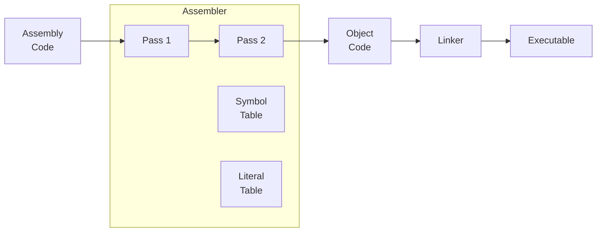

### ARM Cortex-M Processors
- 32-bit Harvard bus architecture
- 32-bit addressing, supporting 4GB of memory space
- Bit Band feature (direct access single bit via address)
- Sleep mode 
- Reduced Instruction Set Computing (RISC)
>[!fact] fact
> RISC CPU means all instructions have **same size** and use similar amount of time for decoding and executing instruction, which can be easily **optimized** and run faster. However, the CPU units use registers for input and **cannot** access memory directly.

### Instruction Set Architecture (ISA)
- hardware divide instructions
- memory access instructions supporting 8-bit, 16-bit, 32-bit, 64-bit
- multiply accumulate (MAC) and saturate arithmetic instructions
- Single Instruction Multiple Data (SIMD)  

>[!tip] Tips
> Cortex-M processor source code was licensed using **Verilog-HDL** (Hardware Description Language). The developing platform is **MDK ARM** (Keli Microcontroller Development Kit).

### Advantages of Cortex-M processors
1) Low power: Support sleep mode
2) Performance: Handle complex applications
3) Energy efficiency: Combining low power and high performance attributes
4) Code density: Thumb ISA allows completing same task using smaller program size
5) Interrupts: Built with interrupt controller (suitable for real-time control)
6) Ease of use: Can program it about everything in C language
7) Scalability: Scale from low-cost to high end micro-controllers
8) Debug features: Analyze design problems easily
9) Operation System support

### Applications of Cortex-M processors
1) Micro-controllers in electrical appliances
2) Automotive 
3) Data communications like Bluetooth and ZigBee
4) Industrial control applications
5) Consumer products
6) System-on-Chips (SoC)

### Background and History of ARM
ARM was formed in 1990 as Advanced RISC Machines Ltd. It became the first-choice for mobile devices like smartphones. The processor family name "Cortex" is divided into 3 profiles: 
- **A** profile: high-performance open **application** platforms
- **R** profile: high-end embedded systems with **real-time** performance
- **M** profile: deeply embedded **micro-controller-type** system

### What is Assembly Language ?
It is a low level programming language that manipulate hardware directly. The main ideas are mnemonic opcodes and symbolic addresses. There are different types of Assembly languages and you have learnt them all before:
1) **ARM Architecture** (current)
2) **MIPS** Architecture (computer architecture course)
3) **x86** Architecture (computer composition course)

### ARM Assembly Features
- Load-Store architecture:
	- Load (from memory to CPU registers)
	- Store (from CPU registers to memory)
- Fixed-length (32-bit) instructions
- Conditional execution of ALL instructions using condition register (CPSR)

| Register Name                                    | Usage                              |
| ------------------------------------------------ | ---------------------------------- |
| R0-R12                                           | General purpose registers          |
| R14                                              | Link register (calling subroutine) |
| R15                                              | Program counter (PC)               |
| **[[03 Functions in Assembly#^8379c4 \| CPSR]]** | Current program status register    |

### Assembler Directives

##### Pass 1 - Analysis
- Separate assembly statement into symbol, mnemonic opcode and operand
- Create symbol and literal tables
- Tract location counter
- Error checking

##### Pass 2 - Synthesis
- Assemble into object code via:
- Replace symbolic addresses with absolute addresses
- Replace symbolic opcode with binary opcode

