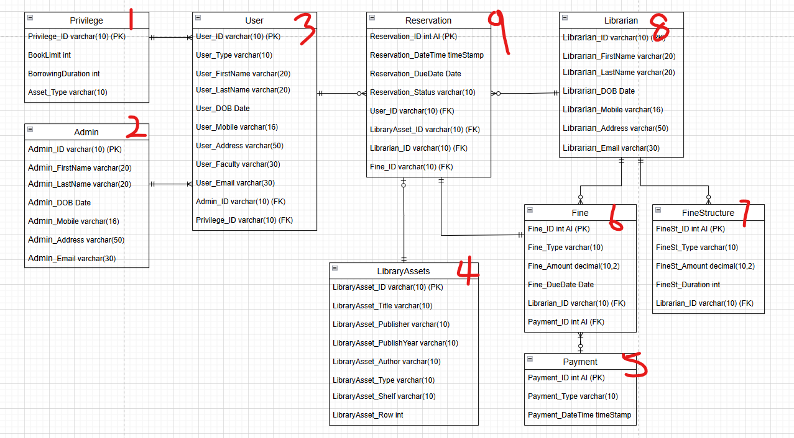

# 关于 LibrarySystem 代码笔记

首先，`CREATE TABLE` 大家都知道，随便一把 Queries 就通关了。唯一的难度是要确定 `CREATE` 的顺序，因为有 `foreign key`。可以参考一下图 2.0。


```
-- create database
drop database LibrarySystem;
create database LibrarySystem;
use LibrarySystem;

-- create table
-- Admin
create table Admin(
Admin_ID varchar(10) NOT NULL PRIMARY KEY,
Admin_FirstName varchar(20) NOT NULL,
Admin_LastName varchar(20) NOT NULL,
Admin_DOB Date,
Admin_Mobile varchar(16),
Admin_Address varchar(50),
Admin_Email varchar(30)
);
-- Privilege
create table Privilege(
Privilege_ID varchar(10) NOT NULL PRIMARY KEY,
ReservationLimit int NOT NULL,
BorrowingDuration int NOT NULL,
Asset_Type varchar(30) NOT NULL
);
-- User
create table User(
User_ID varchar(10) NOT NULL PRIMARY KEY,
User_Type varchar(10) NOT NULL,
User_FirstName varchar(20) NOT NULL,
User_LastName varchar(20) NOT NULL,
User_DOB Date,
User_Mobile varchar(16),
User_Address varchar(50),
User_Faculty varchar(50),
User_Email varchar(30),
Student_Intake varchar(10),
Student_Course varchar(30),
Student_Status varchar(20),
Staff_WorkingDate Date,
Staff_Salary decimal(10,2),
Staff_Office varchar(10),
Admin_ID varchar(10), -- FK
Privilege_ID varchar(10), -- FK
foreign key fk_Admin_ID(Admin_ID) references Admin(Admin_ID),
foreign key fk_Privelige_ID(Privilege_ID) references Privilege(Privilege_ID)
);
-- Librarian
create table Librarian(
Librarian_ID varchar(10) NOT NULL PRIMARY KEY,
Librarian_FirstName varchar(20) NOT NULL,
Librarian_LastName varchar(20) NOT NULL,
Librarian_DOB Date,
Librarian_Mobile varchar(16),
Librarian_Address varchar(50),
Librarian_Email varchar(30)
);
-- FineStructure
create table FineStructure(
FineSt_ID varchar(10) not null primary key,
FineSt_Type varchar(20),
FineSt_Amount decimal(10,2),
FineSt_Duration int,
Librarian_ID varchar(10), -- FK
foreign key fk_Librarian_ID(Librarian_ID) references Librarian(Librarian_ID)
);
-- Payment 
create table Payment(
Payment_ID int NOT NULL auto_increment unique,
Payment_Type varchar(20),
Payment_DateTime timestamp default (current_timestamp())
);
-- Fine
create table Fine(
Fine_ID int NOT NULL primary key auto_increment unique,
Fine_Type varchar(20),
Fine_Amount decimal(10,2),
Fine_DueDate Date,
Librarian_ID varchar(10), -- FK
Payment_ID int, -- FK
foreign key fk_Librarian_ID(Librarian_ID) references Librarian(Librarian_ID),
foreign key fk_Payment_ID(Payment_ID) references Payment(Payment_ID)
);
-- LibraryAssets
create table LibraryAssets(
LibraryAsset_ID varchar(10) NOT NULL PRIMARY KEY,
LibraryAsset_Title varchar(50),
LibraryAsset_Publisher varchar(50),
LibraryAsset_PublishYear varchar(10),
LibraryAsset_Author varchar(30),
LibraryAsset_Type varchar(10) NOT NULL,
LibraryAsset_Shelf varchar(10),
LibraryAsset_Row int,
Book_Page int,
Book_Type varchar(20),
EJournal_VolumnPage int,
EJournal_Size decimal(10,2),
Movie_Duration int,
Movie_Rating int,
Movie_Genre varchar(20)
);
-- Reservation
create table Reservation(
Reservation_ID int NOT NULL auto_increment unique,
Reservation_DateTime timestamp default (current_timestamp()),
Reservation_DueDate Date,
Reservation_Status varchar(20),
User_ID varchar(10), -- FK
LibraryAsset_ID varchar(10), -- FK
Librarian_ID varchar(10), -- FK
Fine_ID int, -- FK
foreign key fk_User_ID(User_ID) references User(User_ID),
foreign key fk_LibraryAsset_ID(LibraryAsset_ID) references LibraryAssets(LibraryAsset_ID),
foreign key fk_Librarian_ID(Librarian_ID) references Librarian(Librarian_ID),
foreign key fk_Fine_ID(Fine_ID) references Fine(Fine_ID)
);

```
--- 

### 如何判断 `CREATE TABLE` 顺序?
 通常只要确保 `Create` 的顺序先是 **没有** `foreign key` 的 `TABLE`, 然后才是有 `foreign key` 但**同时又是**其他人的 `foreign key` 的（比如 `User，Fine`）， 最后才到最多`foreign key` 的 (如`Reservation`)。
##### 图 2.0 （可能与以上代码不同顺序)


---


### BOSS 关卡： 如何`INSERT INTO`?

在制造 `Mock data` 的途中， 你会发现一下问题：
1) 不同的 User 有不同的 Privilege_ID 范围， 要怎样才能有效的提供他们对应的 Privilege_Id 呢？
2) 要如何根据每人的 Privilege 来计算 Reservation_DueDate?
3) 如何提供 Reservation_Status，但必须确保该 LibraryAsset 不是已经借去了？
4) 如何提供 Reservation 的 LibraryAsset？ 它必须是 User 的 Privilege 范围呢， 加上不属于 Reservation_Status 的 “Not Returned” 中。。。
5) 是先有 Fine 还是 先有 Reservation？如果是前者，那又要如何确定 fine_duedate 不和 Reservation_dueDate 重合, 甚至fine_duedate 要在 reservation_duedate 之后？
6) 要有 Fine 才能有 Payment？


其实， 如果在正常应用下， 图书馆管理员`LIBRARIAN` 会根据当日的情况，计算那个人的 Reservation_Status, Reservation_DueDate, Fine_dueDate 等。加上借过的书，肯定不会有 concurrency 的问题，借了只要没还，其他人肯定借不到。可是，我们要 `MOCK data` 啊😱😱😱。所以，有了一下分阶段的代码解析：

```

INSERT INTO Admin (
    Admin_ID,
    Admin_FirstName,
    Admin_LastName,
    Admin_DOB,
    Admin_Mobile,
    Admin_Address,
    Admin_Email
) VALUES
('A0001', 'Broddie', 'Grishenkov', '2004-12-01', '018-843-5508', 'No. 24, Jalan Rimba, Selangor.', 'Cherice@outlook.com'),
('A0002', 'Cecilius', 'Weblin', '2000-06-11', '018-370-4588', 'No. 7, Jalan Sri Mawar, Johor.', 'Thadeus@yahoo.com'),
('A0003', 'Aylmar', 'Nussii', '2004-05-22', '014-093-7640', 'No. 19, Jalan Lili, Melaka.', 'Charis@gmail.com'),
('A0004', 'Nathaniel', 'Demcik', '1999-10-06', '017-755-7474', 'No. 3, Jalan Merbok, Perak.', 'Martita@outlook.com'),
('A0005', 'Barney', 'Swindles', '2001-03-24', '011-787-7811', 'No. 8, Jalan Cendana, Kedah.', 'Donnell@gmail.com'),
('A0006', 'Jade', 'Burling', '2001-06-03', '014-246-4725', 'No. 13, Jalan Wawasan, Perlis.', 'Vernice@gmail.com'),
('A0007', 'Romain', 'Atterbury', '2003-03-04', '019-454-0520', 'No. 26, Jalan Putra, Sabah.', 'Camey@outlook.com'),
('A0008', 'Val', 'Petry', '2002-08-30', '018-462-0764', 'No. 4, Jalan Tenaga, Sarawak.', 'Caprice@yahoo.com'),
('A0009', 'Tamra', 'Jessop', '2004-04-08', '011-351-1159', 'No. 12, Jalan Aman, Pahang.', 'Reggie@gmail.com'),
('A0010', 'Ernestine', 'Vernau', '2005-04-22', '012-613-9803', 'No. 9, Jalan Damai, Kelantan.', 'Hyacinthia@gmail.com'),
('A0011', 'Paige', 'Cossans', '2005-05-06', '019-856-5374', 'No. 15, Jalan Setia, Selangor.', 'Hyacintha@outlook.com'),
('A0012', 'Johnnie', 'Selliman', '2003-07-24', '018-614-4947', 'No. 11, Jalan Harmoni, Johor.', 'Chalmers@gmail.com'),
('A0013', 'Agnese', 'Oolahan', '1999-01-18', '013-389-4743', 'No. 8, Jalan Indah, Melaka.', 'Chrystel@gmail.com'),
('A0014', 'Winonah', 'Bullas', '2001-05-03', '012-574-9566', 'No. 14, Jalan Jelapang, Perak.', 'Derrik@yahoo.com'),
('A0015', 'Gui', 'Dibnah', '2002-12-10', '011-319-1696', 'No. 6, Jalan Seri Cempaka, Kedah.', 'Joell@yahoo.com'),
('A0016', 'Torrin', 'Playfoot', '2005-03-09', '012-699-8526', 'No. 10, Jalan Berlian, Perlis.', 'Hartley@gmail.com'),
('A0017', 'Galvan', 'Pott', '2003-03-01', '013-406-6829', 'No. 20, Jalan Gemilang, Sabah.', 'Cissiee@yahoo.com');

INSERT INTO Privilege (
    Privilege_ID,
    ReservationLimit,
    BorrowingDuration,
    Asset_Type
) VALUES
('P0001', 2, 7, 'Book'),
('P0002', 5, 10, 'Book'),
('P0003', 2, 10, 'Book, EJournal'),
('P0004', 5, 20, 'Book, EJournal'),
('P0005', 5, 20, 'Book, EJournal, Movie'),
('P0006', 5, 20, 'Book'),
('P0007', 8, 30, 'Book'),
('P0008', 5, 30, 'Book, EJournal'),
('P0009', 10, 50, 'Book, EJournal'),
('P0010', 15, 60, 'Book, EJournal, Movie');


INSERT INTO user (User_ID, User_Type, User_FirstName, User_LastName, User_DOB, User_Mobile, User_Address, User_Faculty, User_Email, Student_Intake, Student_Course, Student_Status, Staff_WorkingDate, Staff_Salary, Staff_Office, Admin_ID, Privilege_ID) VALUES ('STU0001', 'Student', 'Florette', 'Squibb', '2002-08-01', '011-457-3821', 'No. 12, Jalan Kenanga, Selangor.', 'School of Computer Engineering', 'Aurelia@outlook.com', '2024-04-01', 'Computer Science', 'Undergraduate', '1900-01-01', 0.0, NULL, 'A0001', 'P0001'),
('STU0002', 'Student', 'Locke', 'Shah', '2004-10-18', '018-123-6222', 'No. 8, Jalan Mawar, Johor.', 'School of Mathematics', 'Sigismundo@outlook.com', '2023-09-01', 'Mathematics', 'Graduate', '1900-01-01', 0.0, NULL, 'A0002', 'P0005'),
('STU0003', 'Student', 'Brig', 'Burnard', '2004-01-02', '017-685-9865', 'No. 22, Jalan Cempaka, Melaka.', 'School of Economics and Management', 'Verne@gmail.com', '2023-02-01', 'Finance', 'Undergraduate', '1900-01-01', 0.0, NULL, 'A0003', 'P0005'),    
('STU0004', 'Student', 'Marybelle', 'Quiddihy', '2005-09-29', '012-233-0410', 'No. 17, Jalan Melur, Perak.', 'School of Energy and Chemical Engineering', 'Finn@yahoo.com', '2021-09-01', 'Chemical', 'Graduate', '1900-01-01', 0.0, NULL, 'A0004', 'P0002'),
('STU0005', 'Student', 'Orelie', 'Brunner', '2001-01-15', '011-833-3283', 'No. 9, Jalan Anggerik, Kedah.', 'School of Humanities and Communication', 'Roxane@gmail.com', '2024-02-01', 'Journalism', 'Undergraduate', '1900-01-01', 0.0, NULL, 'A0005', 'P0002'),
('STU0006', 'Student', 'Joshia', 'Jain', '1999-07-03', '016-923-6109', 'No. 10, Jalan Dahlia, Perlis.', 'School of Computer Engineering', 'Guglielma@gmail.com', '2022-04-01', 'Artificial Intelligence', 'Undergraduate', '1900-01-01', 0.0, NULL, 'A0006', 'P0004'),
('STU0007', 'Student', 'Giulio', 'Godbold', '2004-07-18', '016-383-2623', 'No. 5, Jalan Teratai, Sabah.', 'School of Economics and Management', 'Saudra@yahoo.com', '2019-04-01', 'Account', 'Undergraduate', '1900-01-01', 0.0, NULL, 'A0007', 'P0002'),   
('STU0008', 'Student', 'Cherish', 'Baden', '1998-11-18', '012-014-7181', 'No. 30, Jalan Seroja, Sarawak.', 'School of Energy and Chemical Engineering', 'Humphrey@gmail.com', '2021-09-01', 'Pharmacy', 'Graduate', '1900-01-01', 0.0, NULL, 'A0008', 'P0003'),
('STU0009', 'Student', 'Ted', 'Behagg', '1998-10-22', '018-657-4045', 'No. 15, Jalan Bunga Raya, Pahang.', 'School of Humanities and Communication', 'Abraham@outlook.com', '2022-04-01', 'Advertising', 'Graduate', '1900-01-01', 0.0, NULL, 'A0009', 'P0004'),
('STU0010', 'Student', 'Carolina', 'Gaitley', '1999-09-01', '016-254-8472', 'No. 3, Jalan Kemboja, Kelantan.', 'School of Computer Engineering', 'Eziechiele@yahoo.com', '2022-09-01', 'Software', 'Undergraduate', '1900-01-01', 0.0, NULL, 'A0010', 'P0001'),
('STU0011', 'Student', 'Jessee', 'Benedito', '2004-07-20', '016-400-2656', 'No. 25, Jalan Sri Pinang, Penang.', 'School of Mathematics', 'Delphinia@gmail.com', '2023-09-01', 'Mathematics', 'Graduate', '1900-01-01', 0.0, NULL, 'A0011', 'P0003'),        
('STU0012', 'Student', 'Frankie', 'Opy', '1998-05-01', '014-203-1118', 'No. 18, Jalan Bakawali, Terengganu.', 'School of Humanities and Communication', 'Aguste@outlook.com', '2022-09-01', 'Advertising', 'Undergraduate', '1900-01-01', 0.0, NULL, 'A0012', 'P0005'),
('STU0013', 'Student', 'Walsh', 'Gagie', '2001-10-24', '011-780-4458', 'No. 6, Jalan Lavender, Negeri Sembilan.', 'School of Energy and Chemical Engineering', 'Nadine@gmail.com', '2021-02-01', 'Chemical', 'Graduate', '1900-01-01', 0.0, NULL, 'A0013', 'P0003'),
('STU0014', 'Student', 'Leanna', 'Berthot', '1998-05-20', '017-374-8919', 'No. 4, Jalan Tanjung, Selangor.', 'School of Computer Engineering', 'Parke@gmail.com', '2022-09-01', 'Artificial Intelligence', 'Graduate', '1900-01-01', 0.0, NULL, 'A0014', 'P0004'),
('STU0015', 'Student', 'Catlin', 'Chapelle', '1998-03-11', '015-992-8014', 'No. 21, Jalan Kundur, Johor.', 'School of Economics and Management', 'Boonie@outlook.com', '2020-09-01', 'Finance', 'Undergraduate', '1900-01-01', 0.0, NULL, 'A0015', 'P0003'),
('STU0016', 'Student', 'Anatollo', 'Seally', '2001-03-15', '018-167-2948', 'No. 12, Jalan Meranti, Melaka.', 'School of Mathematics', 'Priscella@outlook.com', '2020-04-01', 'Mathematics', 'Graduate', '1900-01-01', 0.0, NULL, 'A0016', 'P0001'),
('STU0017', 'Student', 'Brantley', 'Iglesiaz', '2001-06-27', '012-162-9042', 'No. 19, Jalan Sepang, Perak.', 'School of Energy and Chemical Engineering', 'Fabian@gmail.com', '2019-09-01', 'Pharmacy', 'Graduate', '1900-01-01', 0.0, NULL, 'A0017', 'P0001'),
('STU0018', 'Student', 'Keely', 'McPolin', '1998-03-30', '015-882-1996', 'No. 8, Jalan Kenari, Kedah.', 'School of Humanities and Communication', 'Joann@gmail.com', '2020-09-01', 'Journalism', 'Graduate', '1900-01-01', 0.0, NULL, 'A0001', 'P0003'),    
('STU0019', 'Student', 'Mirabel', 'Pavic', '1998-08-12', '019-695-2424', 'No. 11, Jalan Heliconia, Perlis.', 'School of Computer Engineering', 'Hinda@yahoo.com', '2023-02-01', 'Software', 'Undergraduate', '1900-01-01', 0.0, NULL, 'A0002', 'P0002'),    
('STU0020', 'Student', 'Gwenny', 'Antonescu', '2004-11-04', '014-457-7287', 'No. 26, Jalan Melati, Sabah.', 'School of Economics and Management', 'Mohandis@outlook.com', '2024-02-01', 'Account', 'Undergraduate', '1900-01-01', 0.0, NULL, 'A0003', 'P0005'),
('STU0021', 'Student', 'Florri', 'Ayscough', '1998-11-04', '012-778-8773', 'No. 7, Jalan Selasih, Sarawak.', 'School of Humanities and Communication', 'Myriam@gmail.com', '2019-02-01', 'Advertising', 'Graduate', '1900-01-01', 0.0, NULL, 'A0004', 'P0001'),
('STU0022', 'Student', 'Rosina', 'Emlyn', '2003-01-27', '014-356-2530', 'No. 2, Jalan Inai, Pahang.', 'School of Mathematics', 'Gena@gmail.com', '2022-04-01', 'Mathematics', 'Undergraduate', '1900-01-01', 0.0, NULL, 'A0005', 'P0004'),
('STU0023', 'Student', 'Daven', 'Ormesher', '2005-10-28', '010-143-1954', 'No. 14, Jalan Palma, Kelantan.', 'School of Computer Engineering', 'Clayton@gmail.com', '2022-04-01', 'Computer Science', 'Undergraduate', '1900-01-01', 0.0, NULL, 'A0006', 'P0003'),
('STU0024', 'Student', 'Dorolisa', 'Peare', '2005-12-23', '010-246-4876', 'No. 10, Jalan Jati, Penang.', 'School of Economics and Management', 'Marchall@outlook.com', '2023-04-01', 'Finance', 'Graduate', '1900-01-01', 0.0, NULL, 'A0007', 'P0001'),     
('STU0025', 'Student', 'Myrtle', 'Swinburne', '2002-08-01', '017-394-7018', 'No. 13, Jalan Saga, Terengganu.', 'School of Energy and Chemical Engineering', 'Becka@outlook.com', '2019-04-01', 'Chemical', 'Undergraduate', '1900-01-01', 0.0, NULL, 'A0008', 'P0002'),
('STU0026', 'Student', 'Abigael', 'Pomfrett', '2004-04-16', '014-870-2865', 'No. 28, Jalan Bayu, Negeri Sembilan.', 'School of Humanities and Communication', 'Jerri@gmail.com', '2019-09-01', 'Journalism', 'Graduate', '1900-01-01', 0.0, NULL, 'A0009', 'P0001'),
('STU0027', 'Student', 'Paulina', 'Kenrick', '2005-08-25', '015-278-8390', 'No. 16, Jalan Laksamana, Selangor.', 'School of Computer Engineering', 'Elle@yahoo.com', '2019-04-01', 'Artificial Intelligence', 'Undergraduate', '1900-01-01', 0.0, NULL, 'A0010', 'P0005'),
('STF0001', 'Staff', 'Arther', 'Morrilly', '1986-08-06', '010-855-6163', 'No. 31, Jalan Kiara, Johor.', 'School of Energy and Chemical Engineering', 'Mohammed@gmail.com', NULL, NULL, NULL, '2001-12-19', 8380.72, 'A5-105', 'A0011', 'P0007'),
('STF0002', 'Staff', 'Tabor', 'Turl', '1994-10-15', '010-335-4600', 'No. 20, Jalan Sena, Melaka.', 'School of Computer Engineering', 'Berkly@outlook.com', NULL, NULL, NULL, '2018-06-13', 9349.15, 'A2-005', 'A0012', 'P0009'),
('STF0003', 'Staff', 'Sabine', 'Wibberley', '1958-05-26', '014-037-3304', 'No. 9, Jalan Beringin, Perak.', 'School of Mathematics', 'Milka@outlook.com', NULL, NULL, NULL, '2010-04-06', 10547.18, 'A2-409', 'A0013', 'P0007'),
('STF0004', 'Staff', 'Ilene', 'Pensom', '1983-05-25', '013-574-5653', 'No. 5, Jalan Cemara, Kedah.', 'School of Economics and Management', 'Correy@gmail.com', NULL, NULL, NULL, '2013-01-07', 23451.8, 'A2-301', 'A0014', 'P0010'),
('STF0005', 'Staff', 'Fredrick', 'Keen', '1994-09-21', '012-312-8126', 'No. 1, Jalan Bakti, Perlis.', 'School of Energy and Chemical Engineering', 'Tore@yahoo.com', NULL, NULL, NULL, '1984-02-06', 24320.89, 'A4-207', 'A0015', 'P0007'),
('STF0006', 'Staff', 'Ashlin', 'Mutter', '1966-04-14', '018-515-9497', 'No. 22, Jalan Palma Indah, Sabah.', 'School of Humanities and Communication', 'Avivah@gmail.com', NULL, NULL, NULL, '2000-06-23', 25458.56, 'A5-206', 'A0016', 'P0009'),
('STF0007', 'Staff', 'Janka', 'Joire', '1995-07-08', '010-853-1363', 'No. 27, Jalan Cempa, Sarawak.', 'School of Computer Engineering', 'Guinna@gmail.com', NULL, NULL, NULL, '1982-12-29', 9022.87, 'A5-108', 'A0017', 'P0009'),
('STF0008', 'Staff', 'Isidora', 'Mulrean', '1970-02-28', '017-052-2924', 'No. 6, Jalan Seri Melati, Pahang.', 'School of Economics and Management', 'Wallie@gmail.com', NULL, NULL, NULL, '1983-06-03', 22091.19, 'A1-904', 'A0001', 'P0010'),
('STF0009', 'Staff', 'Yancey', 'Derkes', '1951-05-23', '014-091-1107', 'No. 18, Jalan Zinnia, Kelantan.', 'School of Energy and Chemical Engineering', 'Stephen@yahoo.com', NULL, NULL, NULL, '2020-08-22', 24118.71, 'A4-500', 'A0002', 'P0007'),
('STF0010', 'Staff', 'Bail', 'Lawtie', '1978-12-29', '012-500-3552', 'No. 3, Jalan Alamanda, Penang.', 'School of Humanities and Communication', 'Orel@gmail.com', NULL, NULL, NULL, '2002-12-25', 27186.04, 'A5-300', 'A0003', 'P0009'),
('STF0011', 'Staff', 'Bondon', 'Romke', '1985-10-01', '015-673-7077', 'No. 23, Jalan Sejati, Terengganu.', 'School of Computer Engineering', 'Lilia@yahoo.com', NULL, NULL, NULL, '2014-03-03', 8583.88, 'A2-904', 'A0004', 'P0006'),
('STF0012', 'Staff', 'Kerwin', 'Castagne', '1959-11-03', '016-011-9485', 'No. 14, Jalan Senangin, Negeri Sembilan.', 'School of Mathematics', 'Igor@outlook.com', NULL, NULL, NULL, '1993-10-31', 25785.5, 'A2-305', 'A0005', 'P0010'),
('STF0013', 'Staff', 'Vonni', 'Cobleigh', '1994-02-27', '013-039-6512', 'No. 8, Jalan Kesturi, Selangor.', 'School of Humanities and Communication', 'Ealasaid@gmail.com', NULL, NULL, NULL, '2005-02-11', 7257.06, 'A5-304', 'A0006', 'P0006'),
('STF0014', 'Staff', 'Candra', 'Varah', '1954-05-22', '011-767-2129', 'No. 30, Jalan Timur, Johor.', 'School of Energy and Chemical Engineering', 'Lynnelle@yahoo.com', NULL, NULL, NULL, '2017-10-28', 11295.14, 'A4-004', 'A0007', 'P0006'),
('STF0015', 'Staff', 'Sax', 'Gladdis', '1980-07-09', '017-434-9390', 'No. 7, Jalan Barat, Melaka.', 'School of Computer Engineering', 'Eda@outlook.com', NULL, NULL, NULL, '2015-11-16', 13294.82, 'A5-704', 'A0008', 'P0006'),
('STF0016', 'Staff', 'Roseanne', 'Grealy', '1956-05-05', '012-628-3749', 'No. 16, Jalan Permai, Perak.', 'School of Economics and Management', 'Norry@yahoo.com', NULL, NULL, NULL, '2003-10-15', 3944.07, 'A5-105', 'A0009', 'P0008'),
('STF0017', 'Staff', 'Henri', 'Twelve', '1993-07-31', '019-956-4212', 'No. 12, Jalan Seri Kenanga, Kedah.', 'School of Mathematics', 'Perceval@outlook.com', NULL, NULL, NULL, '1981-01-11', 6472.83, 'A5-800', 'A0010', 'P0010'),
('STF0018', 'Staff', 'Anstice', 'Bollon', '1985-05-14', '017-375-5732', 'No. 10, Jalan Jelawat, Perlis.', 'School of Energy and Chemical Engineering', 'Kevin@outlook.com', NULL, NULL, NULL, '1986-01-24', 20003.8, 'A1-406', 'A0011', 'P0010'),
('STF0019', 'Staff', 'Gustavus', 'Jarnell', '1958-05-10', '012-442-5291', 'No. 25, Jalan Ilmu, Sabah.', 'School of Humanities and Communication', 'Abbye@outlook.com', NULL, NULL, NULL, '1997-10-05', 15700.01, 'A2-800', 'A0012', 'P0010'),
('STF0020', 'Staff', 'Alla', 'Leversha', '1978-05-11', '012-372-5001', 'No. 18, Jalan Pelangi, Sarawak.', 'School of Computer Engineering', 'Udale@gmail.com', NULL, NULL, NULL, '2018-09-20', 23019.1, 'A2-908', 'A0013', 'P0008'),
('STF0021', 'Staff', 'Alexandra', 'Sultana', '1951-01-23', '014-652-2002', 'No. 21, Jalan Ceria, Pahang.', 'School of Economics and Management', 'Derril@gmail.com', NULL, NULL, NULL, '2014-01-01', 12671.03, 'A1-407', 'A0014', 'P0009');


 INSERT INTO Librarian (
    Librarian_ID,
    Librarian_FirstName,
    Librarian_LastName,
    Librarian_DOB,
    Librarian_Mobile,
    Librarian_Address,
    Librarian_Email
) VALUES
('L0001', 'John', 'Tan', '1990-01-15', '012-3456789', 'No. 7, Jalan Cahaya, Sarawak.', 'john.tan@xmu.edu.my'),
('L0002', 'Emily', 'Lim', '1985-02-20', '013-9876543', 'No. 3, Jalan Selamat, Pahang.', 'emily.lim@xmu.edu.my'),
('L0003', 'Michael', 'Ng', '1992-03-25', '014-6789123', 'No. 18, Jalan Murni, Kelantan.', 'michael.ng@xmu.edu.my'),
('L0004', 'Sophia', 'Lee', '1994-04-10', '016-4567890', 'No. 12, Jalan Bahagia, Selangor.', 'sophia.lee@xmu.edu.my'),
('L0005', 'Daniel', 'Ong', '1988-05-30', '017-5678901', 'No. 9, Jalan Cempedak, Johor.', 'daniel.ong@xmu.edu.my'),
('L0006', 'Grace', 'Chan', '1995-06-18', '018-2345678', 'No. 21, Jalan Sejahtera, Melaka.', 'grace.chan@xmu.edu.my'),
('L0007', 'Benjamin', 'Wong', '1993-07-09', '019-8765432', 'No. 5, Jalan Melati Indah, Perak.', 'benjamin.wong@xmu.edu.my'),
('L0008', 'Olivia', 'Teo', '1991-08-22', '011-2345678', 'No. 17, Jalan Flora, Kedah.', 'olivia.teo@xmu.edu.my'),
('L0009', 'Samuel', 'Chong', '1987-09-14', '012-8765432', 'No. 4, Jalan Mahsuri, Perlis.', 'samuel.chong@xmu.edu.my'),
('L0010', 'Hannah', 'Lau', '1996-10-05', '013-4567890', 'No. 28, Jalan Putri, Sabah.', 'hannah.lau@xmu.edu.my'),
('L0011', 'Christopher', 'Yap', '1989-11-12', '014-2345678', 'No. 19, Jalan Berlian Indah, Sarawak.', 'christopher.yap@xmu.edu.my'),
('L0012', 'Charlotte', 'Foo', '1997-12-08', '016-3456789', 'No. 11, Jalan Nilam, Pahang.', 'charlotte.foo@xmu.edu.my'),
('L0013', 'David', 'Goh', '1986-03-17', '017-9876543', 'No. 7, Jalan Sutera, Kelantan.', 'david.goh@xmu.edu.my'),
('L0014', 'Ella', 'Sim', '1992-04-19', '018-4567890', 'No. 22, Jalan Desa, Penang.', 'ella.sim@xmu.edu.my'),
('L0015', 'James', 'Chin', '1984-05-11', '019-2345678', 'No. 14, Jalan Pantai, Terengganu.', 'james.chin@xmu.edu.my'),
('L0016', 'Amelia', 'Nguyen', '1998-06-15', '011-8765432', 'No. 3, Jalan Suria, Negeri Sembilan.', 'amelia.nguyen@xmu.edu.my'),
('L0017', 'Matthew', 'Cheong', '1983-07-27', '012-5678901', 'No. 16, Jalan Angkasa, Selangor.', 'matthew.cheong@xmu.edu.my'),
('L0018', 'Lily', 'Chia', '1994-08-03', '013-3456789', 'No. 10, Jalan Kasih, Johor.', 'lily.chia@xmu.edu.my'),
('L0019', 'Andrew', 'Liew', '1985-09-10', '014-8765432', 'No. 25, Jalan Kebun, Melaka.', 'andrew.liew@xmu.edu.my'),
('L0020', 'Chloe', 'Tay', '1990-10-21', '016-2345678', 'No. 6, Jalan Mawar Putih, Perak.', 'chloe.tay@xmu.edu.my'),
('L0021', 'Joseph', 'Koh', '1987-11-06', '017-3456789', 'No. 12, Jalan Bukit, Kedah.', 'joseph.koh@xmu.edu.my'),
('L0022', 'Sophia', 'Seah', '1996-12-25', '018-9876543', 'No. 18, Jalan Matahari, Perlis.', 'sophia.seah@xmu.edu.my'),
('L0023', 'Joshua', 'Heng', '1989-01-19', '019-4567890', 'No. 9, Jalan Desa Indah, Sabah.', 'joshua.heng@xmu.edu.my'),
('L0024', 'Mia', 'Quek', '1995-02-14', '011-5678901', 'No. 20, Jalan Idaman, Sarawak.', 'mia.quek@xmu.edu.my'),
('L0025', 'Alexander', 'Loke', '1988-03-29', '012-8765432', 'No. 1, Jalan Permata, Pahang.', 'alexander.loke@xmu.edu.my'),
('L0026', 'Emma', 'Ho', '1997-04-04', '013-2345678', 'No. 30, Jalan Kenyalang, Kelantan.', 'emma.ho@xmu.edu.my');

INSERT INTO FineStructure (
    FineSt_ID,
    FineSt_Type,
    FineSt_Amount,
    FineSt_Duration,
    Librarian_ID
) VALUES
('FS0001', 'Late Return', 5, 1, 'L0001'),
('FS0002', 'Late Return', 7, 2, 'L0010'),
('FS0003', 'Late Return', 9, 3, 'L0014'),
('FS0004', 'Late Return', 11, 5, 'L0008'),
('FS0005', 'Late Return', 13, 7, 'L0019'),
('FS0006', 'Late Return', 20, 10, 'L0023'),
('FS0007', 'Late Return', 30, 20, 'L0001'),
('FS0008', 'Late Return', 80, 30, 'L0002'),
('FS0009', 'Damage', 30, NULL, 'L0001'),
('FS0010', 'Lost', 80, NULL, 'L0018');

-- INSERT INTO Payment (
--     Payment_ID,
--     Payment_Type,
--     Payment_DateTime
-- ) VALUES
-- (1, 'Online Banking', '2024-08-13 05:13'),
-- (2, 'Cash', '2024-08-16 22:33'),
-- (3, 'E-wallet', '2024-08-15 04:53'),
-- (4, 'E-wallet', '2024-08-13 14:30'),
-- (5, 'E-wallet', '2024-08-14 20:46'),
-- (6, 'E-wallet', '2024-08-16 17:45'),
-- (7, 'Online Banking', '2024-08-21 13:44'),
-- (8, 'Online Banking', '2024-08-21 18:07'),
-- (9, 'Online Banking', '2024-08-23 14:53'),
-- (10, 'Cash', '2024-08-22 15:47'),
-- (11, 'Cash', '2024-08-21 09:00'),
-- (12, 'E-wallet', '2024-08-28 10:11'),
-- (13, 'E-wallet', '2024-08-26 07:41'),
-- (14, 'Cash', '2024-08-26 11:43'),
-- (15, 'E-wallet', '2024-09-02 05:27'),
-- (16, 'Online Banking', '2024-09-01 19:00'),
-- (17, 'E-wallet', '2024-09-03 23:22'),
-- (18, 'Cash', '2024-09-01 23:00'),
-- (19, 'E-wallet', '2024-09-04 14:47'),
-- (20, 'Cash', '2024-09-04 03:03'),
-- (21, 'E-wallet', '2024-09-07 10:46'),
-- (22, 'Online Banking', '2024-09-02 16:55'),
-- (23, 'Online Banking', '2024-09-06 22:30'),
-- (24, 'Cash', '2024-09-09 20:08'),
-- (25, 'E-wallet', '2024-09-08 15:48'),
-- (26, 'E-wallet', '2024-09-10 16:28'),
-- (27, 'E-wallet', '2024-09-12 06:35'),
-- (28, 'Cash', '2024-09-15 09:32'),
-- (29, 'Cash', '2024-09-13 16:22'),
-- (30, 'Online Banking', '2024-09-14 21:30'),
-- (31, 'Online Banking', '2024-09-12 14:12'),
-- (32, 'Online Banking', '2024-09-14 05:17'),
-- (33, 'E-wallet', '2024-09-18 01:34'),
-- (34, 'Online Banking', '2024-09-14 13:14'),
-- (35, 'E-wallet', '2024-09-19 15:44'),
-- (36, 'Cash', '2024-09-21 04:54'),
-- (37, 'E-wallet', '2024-09-23 06:19'),
-- (38, 'E-wallet', '2024-09-23 17:27'),
-- (39, 'Cash', '2024-09-23 07:38'),
-- (40, 'E-wallet', '2024-09-22 09:00'),
-- (41, 'Online Banking', '2024-09-24 17:53'),
-- (42, 'Online Banking', '2024-09-27 02:21'),
-- (43, 'Online Banking', '2024-09-27 03:35'),
-- (44, 'E-wallet', '2024-09-26 06:31'),
-- (45, 'Online Banking', '2024-09-25 07:56'),
-- (46, 'E-wallet', '2024-09-25 06:10'),
-- (47, 'Cash', '2024-09-25 14:53'),
-- (48, 'Online Banking', '2024-10-01 15:30'),
-- (49, 'E-wallet', '2024-10-01 02:05'),
-- (50, 'E-wallet', '2024-10-04 08:29'),
-- (51, 'E-wallet', '2024-10-06 04:05'),
-- (52, 'Cash', '2024-10-06 21:56'),
-- (53, 'Online Banking', '2024-10-10 15:18'),
-- (54, 'Cash', '2024-10-16 01:07'),
-- (55, 'E-wallet', '2024-10-15 04:47'),
-- (56, 'Online Banking', '2024-10-15 03:41'),
-- (57, 'Online Banking', '2024-10-16 07:46'),
-- (58, 'Online Banking', '2024-10-22 08:09'),
-- (59, 'Cash', '2024-10-22 06:25'),
-- (60, 'E-wallet', '2024-10-25 21:54'),
-- (61, 'E-wallet', '2024-10-25 01:03'),
-- (62, 'E-wallet', '2024-10-22 15:18'),
-- (63, 'Cash', '2024-10-24 17:02'),
-- (64, 'Cash', '2024-10-23 08:32'),
-- (65, 'Cash', '2024-10-25 02:14'),
-- (66, 'E-wallet', '2024-10-29 10:51'),
-- (67, 'Cash', '2024-10-25 14:00'),
-- (68, 'E-wallet', '2024-10-26 09:48'),
-- (69, 'Online Banking', '2024-10-28 04:25');


INSERT INTO libraryassets (LibraryAsset_ID, LibraryAsset_Title, LibraryAsset_Publisher, LibraryAsset_PublishYear, LibraryAsset_Author, LibraryAsset_Type, LibraryAsset_Shelf, LibraryAsset_Row, Book_Page, Book_Type, EJournal_VolumnPage, EJournal_Size, Movie_Duration, Movie_Rating, Movie_Genre) VALUES ('B0001', 'Romeo and Juliet', 'MPH Group Publishing Sdn Bhd', 2017.0, 'William Shakespeare', 'Book', 'VU', 3.0, 305.0, 'Romance', 0.0, NULL, NULL, NULL, NULL),
('B0002', 'Pride and Prejudice', 'Evergreen Publisher Sdn Bhd', 2024.0, 'Jane Austen', 'Book', 'CI', 4.0, 128.0, 'Romance', 0.0, NULL, NULL, NULL, NULL),
('B0003', 'Dracula', 'Hup Lick Publishing (M) Sdn Bhd', 2006.0, 'Bram Stoker', 'Book', 'CM', 6.0, 397.0, 'Horror', 0.0, NULL, NULL, NULL, NULL),
('B0004', 'The Big Sleep', 'Attin Press Sdn Bhd', 2000.0, 'Raymond Chandler', 'Book', 'YX', 3.0, 304.0, 'Crime', 0.0, NULL, NULL, NULL, NULL),
('B0005', 'Treasure Island', 'University of Malaya Press', 2014.0, 'Robert Louis Stevenson', 'Book', 'EN', 5.0, 154.0, 'Adventure', 0.0, NULL, NULL, NULL, NULL),
('B0006', 'Sapiens: A Brief History of Humankind', 'Buku Fixi', 2007.0, 'Yuval Noah Harari', 'Book', 'BW', 5.0, 75.0, 'History', 0.0, NULL, NULL, NULL, NULL),
('B0007', 'Mastering the Art of French Cooking', 'Evergreen Publisher Sdn Bhd', 2000.0, 'Julia Child', 'Book', 'CU', 3.0, 261.0, 'Cooking', 0.0, NULL, NULL, NULL, NULL),
('B0008', 'Guns, Germs, and Steel', 'Pelangi Publishing Group', 2002.0, 'Jared Diamond', 'Book', 'MI', 8.0, 269.0, 'History', 0.0, NULL, NULL, NULL, NULL),
('B0009', 'The Silk Roads', 'Orbit Buku Sdn Bhd', 2013.0, 'Peter Frankopan', 'Book', 'SV', 4.0, 87.0, 'History', 0.0, NULL, NULL, NULL, NULL),
('B0010', 'Wuthering Heights', 'Karangkraf Media Group', 2004.0, 'Emily Brontë', 'Book', 'QY', 2.0, 228.0, 'Romance', 0.0, NULL, NULL, NULL, NULL),
('B0011', 'Around the World in Eighty Days', 'Kualiti Books Sdn Bhd', 2012.0, 'Jules Verne', 'Book', 'OW', 4.0, 386.0, 'Adventure', 0.0, NULL, NULL, NULL, NULL),
('B0012', "A People's History of the United States", 'Penerbitan Fajar Bakti Sdn Bhd', 2017.0, 'Howard Zinn', 'Book', 'PY', 4.0, 61.0, 'History', 0.0, NULL, NULL, NULL, NULL),
('B0013', 'In Cold Blood', 'Penerbitan Utusan Melayu (M) Berhad', 1998.0, 'Truman Capote', 'Book', 'CU', 8.0, 156.0, 'Crime', 0.0, NULL, NULL, NULL, NULL),
('B0014', 'A Brief History of Time', 'Penerbitan Karya Seni Sdn Bhd', 2019.0, 'Stephen Hawking', 'Book', 'UM', 6.0, 105.0, 'Science', 0.0, NULL, NULL, NULL, NULL),        
('B0015', 'The Murder of Roger Ackroyd', 'MPH Group Publishing Sdn Bhd', 2021.0, 'Agatha Christie', 'Book', 'JE', 6.0, 190.0, 'Crime', 0.0, NULL, NULL, NULL, NULL),       
('B0016', 'The Wright Brothers', 'Evergreen Publisher Sdn Bhd', 1993.0, 'David McCullough', 'Book', 'MP', 8.0, 111.0, 'History', 0.0, NULL, NULL, NULL, NULL),
('B0017', 'The Joy of Cooking', 'Hup Lick Publishing (M) Sdn Bhd', 1992.0, 'Irma S. Rombauer', 'Book', 'QJ', 4.0, 16.0, 'Cooking', 0.0, NULL, NULL, NULL, NULL),
('B0018', 'The Shining', 'Attin Press Sdn Bhd', 1996.0, 'Stephen King', 'Book', 'WZ', 4.0, 367.0, 'Horror', 0.0, NULL, NULL, NULL, NULL),
('B0019', 'Frankenstein', 'University of Malaya Press', 2014.0, 'Mary Shelley', 'Book', 'OE', 8.0, 159.0, 'Horror', 0.0, NULL, NULL, NULL, NULL),
('B0020', 'Jane Eyre', 'Buku Fixi', 2001.0, 'Charlotte Brontë', 'Book', 'EU', 7.0, 83.0, 'Romance', 0.0, NULL, NULL, NULL, NULL),
('B0021', 'The Diary of a Young Girl', 'Evergreen Publisher Sdn Bhd', 2023.0, 'Anne Frank', 'Book', 'OF', 7.0, 126.0, 'History', 0.0, NULL, NULL, NULL, NULL),
('B0022', 'Team of Rivals', 'Pelangi Publishing Group', 2000.0, 'Doris Kearns Goodwin', 'Book', 'ND', 3.0, 303.0, 'History', 0.0, NULL, NULL, NULL, NULL),
('B0023', 'The Selfish Gene', 'Orbit Buku Sdn Bhd', 1997.0, 'Richard Dawkins', 'Book', 'JI', 9.0, 371.0, 'Science', 0.0, NULL, NULL, NULL, NULL),
('B0024', 'The Call of Cthulhu', 'Karangkraf Media Group', 2012.0, 'H.P. Lovecraft', 'Book', 'AN', 8.0, 26.0, 'Horror', 0.0, NULL, NULL, NULL, NULL),
('B0025', 'The Maltese Falcon', 'Kualiti Books Sdn Bhd', 2013.0, 'Dashiell Hammett', 'Book', 'NU', 6.0, 193.0, 'Crime', 0.0, NULL, NULL, NULL, NULL),
('B0026', 'The Rise and Fall of the Third Reich', 'Penerbitan Fajar Bakti Sdn Bhd', 2018.0, 'William L. Shirer', 'Book', 'LZ', 4.0, 139.0, 'History', 0.0, NULL, NULL, NULL, NULL),
('B0027', 'The Hound of the Baskervilles', 'Penerbitan Utusan Melayu (M) Berhad', 2009.0, 'Arthur Conan Doyle', 'Book', 'AM', 8.0, 256.0, 'Crime', 0.0, NULL, NULL, NULL, NULL),
('B0028', 'Sense and Sensibility', 'Penerbitan Karya Seni Sdn Bhd', 1996.0, 'Jane Austen', 'Book', 'DD', 3.0, 336.0, 'Romance', 0.0, NULL, NULL, NULL, NULL),
('B0029', 'Flatland', 'MPH Group Publishing Sdn Bhd', 2007.0, 'Edwin A. Abbott', 'Book', 'ZO', 9.0, 21.0, 'Mathematics', 0.0, NULL, NULL, NULL, NULL),
('B0030', 'The Man Who Knew Infinity', 'Evergreen Publisher Sdn Bhd', 1994.0, 'Robert Kanigel', 'Book', 'HS', 4.0, 284.0, 'Mathematics', 0.0, NULL, NULL, NULL, NULL),     
('B0031', 'Salt, Fat, Acid, Heat', 'Hup Lick Publishing (M) Sdn Bhd', 2024.0, 'Samin Nosrat', 'Book', 'VK', 6.0, 296.0, 'Cooking', 0.0, NULL, NULL, NULL, NULL),
('B0032', 'The Count of Monte Cristo', 'Attin Press Sdn Bhd', 2006.0, 'Alexandre Dumas', 'Book', 'QY', 3.0, 286.0, 'Adventure', 0.0, NULL, NULL, NULL, NULL),
('B0033', 'Pet Sematary', 'University of Malaya Press', 2023.0, 'Stephen King', 'Book', 'MI', 8.0, 114.0, 'Horror', 0.0, NULL, NULL, NULL, NULL),
('B0034', 'The Flavor Bible', 'Buku Fixi', 2021.0, 'Karen Page', 'Book', 'EJ', 1.0, 235.0, 'Cooking', 0.0, NULL, NULL, NULL, NULL),
('B0035', 'Anna Karenina', 'Evergreen Publisher Sdn Bhd', 2022.0, 'Leo Tolstoy', 'Book', 'NR', 2.0, 88.0, 'Romance', 0.0, NULL, NULL, NULL, NULL),
('J0001', 'Advances in Artificial Intelligence', 'Elsevier', 2001.0, 'John Smith', 'EJournal', NULL, NULL, NULL, NULL, 28.0, 2.18, NULL, NULL, NULL),
('J0002', 'Computational Methods in Data Science', 'Springer', 2002.0, 'Alice Brown', 'EJournal', NULL, NULL, NULL, NULL, 37.0, 3.5, NULL, NULL, NULL),
('J0003', 'Discoveries in Molecular Biology', 'IEEE', 2003.0, 'Robert Johnson', 'EJournal', NULL, NULL, NULL, NULL, 12.0, 4.26, NULL, NULL, NULL),
('J0004', 'Frontiers in Applied Mathematics', 'Wiley', 2004.0, 'Mary Williams', 'EJournal', NULL, NULL, NULL, NULL, 40.0, 1.8, NULL, NULL, NULL),
('J0005', 'Innovations in Organic Chemistry', 'Oxford Press', 2005.0, 'James Jones', 'EJournal', NULL, NULL, NULL, NULL, 18.0, 2.9, NULL, NULL, NULL),
('J0006', 'Advances in Mechanical Engineering', 'Cambridge', 2006.0, 'Patricia Garcia', 'EJournal', NULL, NULL, NULL, NULL, 8.0, 3.0, NULL, NULL, NULL),
('J0007', 'Robotics and Autonomous Systems Journal', 'Taylor & Francis', 2007.0, 'Michael Martinez', 'EJournal', NULL, NULL, NULL, NULL, 35.0, 4.1, NULL, NULL, NULL),     
('J0008', 'Insights in Clinical Medicine', 'Nature Publishing', 2008.0, 'Linda Rodriguez', 'EJournal', NULL, NULL, NULL, NULL, 32.0, 5.0, NULL, NULL, NULL),
('J0009', 'Environmental Science and Policy Forum', 'ScienceDirect', 2009.0, 'David Hernandez', 'EJournal', NULL, NULL, NULL, NULL, 32.0, 2.71, NULL, NULL, NULL),
('J0010', 'Journal of Modern Economic Studies', 'SAGE Journals', 2010.0, 'Barbara Lopez', 'EJournal', NULL, NULL, NULL, NULL, 43.0, 3.8, NULL, NULL, NULL),
('J0011', 'Advances in Social and Cultural Studies', 'BioMed Central', 2011.0, 'William Gonzalez', 'EJournal', NULL, NULL, NULL, NULL, 40.0, 2.1, NULL, NULL, NULL),       
('J0012', 'New Perspectives on Historical Research', 'APA', 2012.0, 'Elizabeth Wilson', 'EJournal', NULL, NULL, NULL, NULL, 37.0, 3.53, NULL, NULL, NULL),
('J0013', 'Innovations in Educational Development', 'MIT Press', 2013.0, 'Charles Anderson', 'EJournal', NULL, NULL, NULL, NULL, 38.0, 4.2, NULL, NULL, NULL),
('J0014', 'Climate Change Research and Applications', 'Harvard University', 2014.0, 'Jennifer Thomas', 'EJournal', NULL, NULL, NULL, NULL, 17.0, 1.8, NULL, NULL, NULL),   
('J0015', 'International Journal of Law Studies', 'PNAS', 2015.0, 'Joseph Taylor', 'EJournal', NULL, NULL, NULL, NULL, 21.0, 2.9, NULL, NULL, NULL),
('J0016', 'Advances in Geographic Information Systems', 'Royal Society', 2016.0, 'Susan Moore', 'EJournal', NULL, NULL, NULL, NULL, 41.0, 3.0, NULL, NULL, NULL),
('J0017', 'Astronomical Discoveries and Theories', 'Cell Press', 2017.0, 'Thomas Jackson', 'EJournal', NULL, NULL, NULL, NULL, 12.0, 4.1, NULL, NULL, NULL),
('J0018', 'Journal of Emerging Quantum Technologies', 'Elsevier', 2018.0, 'Sarah White', 'EJournal', NULL, NULL, NULL, NULL, 42.0, 5.0, NULL, NULL, NULL),
('J0019', 'Trends in Cybersecurity and Networking', 'Springer', 2019.0, 'Christopher Harris', 'EJournal', NULL, NULL, NULL, NULL, 19.0, 2.74, NULL, NULL, NULL),
('J0020', 'Developments in Renewable Energy Systems', 'IEEE', 2020.0, 'Margaret Martin', 'EJournal', NULL, NULL, NULL, NULL, 23.0, 3.86, NULL, NULL, NULL),
('J0021', 'Nanotechnology in Modern Science', 'Taylor & Francis', 2021.0, 'Karen Martinez', 'EJournal', NULL, NULL, NULL, NULL, 36.0, 2.9, NULL, NULL, NULL),
('J0022', 'Breakthroughs in Genomic Analysis', 'ScienceDirect', 2022.0, 'Matthew Clark', 'EJournal', NULL, NULL, NULL, NULL, 20.0, 3.2, NULL, NULL, NULL),
('J0023', 'Ethics in Emerging Technologies', 'Springer', 2023.0, 'Helen Young', 'EJournal', NULL, NULL, NULL, NULL, 16.0, 2.8, NULL, NULL, NULL),
('J0024', 'Exploring Neuroscience Research Techniques', 'MIT Press', 2004.0, 'Anthony Allen', 'EJournal', NULL, NULL, NULL, NULL, 13.0, 3.64, NULL, NULL, NULL),
('J0025', 'Blockchain in Financial Applications', 'Elsevier', 2005.0, 'Deborah Scott', 'EJournal', NULL, NULL, NULL, NULL, 9.0, 4.0, NULL, NULL, NULL),
('J0026', 'Advances in Urban Development Studies', 'Taylor & Francis', 2006.0, 'Mark Wright', 'EJournal', NULL, NULL, NULL, NULL, 16.0, 2.3, NULL, NULL, NULL),
('J0027', 'Sustainable Architecture for Future Cities', 'Royal Society', 2007.0, 'Emily King', 'EJournal', NULL, NULL, NULL, NULL, 42.0, 3.7, NULL, NULL, NULL),
('J0028', 'Machine Learning in Health Sciences', 'BioMed Central', 2008.0, 'Andrew Green', 'EJournal', NULL, NULL, NULL, NULL, 25.0, 4.1, NULL, NULL, NULL),
('J0029', 'Artificial Intelligence in Governance', 'Springer', 2009.0, 'Laura Hall', 'EJournal', NULL, NULL, NULL, NULL, 37.0, 3.41, NULL, NULL, NULL),
('J0030', 'Quantum Computing Applications', 'IEEE', 2010.0, 'Joshua Adams', 'EJournal', NULL, NULL, NULL, NULL, 11.0, 4.8, NULL, NULL, NULL),
('J0031', 'Renewable Energy in Modern Society', 'Nature Publishing', 2011.0, 'Sophia Baker', 'EJournal', NULL, NULL, NULL, NULL, 14.0, 2.5, NULL, NULL, NULL),
('J0032', 'Oceanography and Climate Change Impacts', 'Elsevier', 2012.0, 'Ryan Hill', 'EJournal', NULL, NULL, NULL, NULL, 23.0, 3.9, NULL, NULL, NULL),
('J0033', 'Statistics for Advanced Computational Models', 'Oxford Press', 2013.0, 'Anna Mitchell', 'EJournal', NULL, NULL, NULL, NULL, 8.0, 3.0, NULL, NULL, NULL),        
('J0034', 'Agricultural Sciences and Food Security', 'Cambridge', 2014.0, 'Nicholas Perez', 'EJournal', NULL, NULL, NULL, NULL, 38.0, 3.6, NULL, NULL, NULL),
('J0035', 'Psychological Impacts of Global Changes', 'Wiley', 2015.0, 'Sandra Carter', 'EJournal', NULL, NULL, NULL, NULL, 12.0, 4.32, NULL, NULL, NULL),
('J0036', 'Advances in Public Health Innovations', 'PNAS', 2016.0, 'Ethan Roberts', 'EJournal', NULL, NULL, NULL, NULL, 10.0, 3.1, NULL, NULL, NULL),
('J0037', 'Urban Sustainability and Environmental Studies', 'Springer', 2017.0, 'Emma Walker', 'EJournal', NULL, NULL, NULL, NULL, 16.0, 2.95, NULL, NULL, NULL),
('J0038', 'Cultural Studies and Globalization Trends', 'ScienceDirect', 2018.0, 'Alexander Phillips', 'EJournal', NULL, NULL, NULL, NULL, 45.0, 4.2, NULL, NULL, NULL),    
('J0039', 'Philosophical Insights into Modern Science', 'Taylor & Francis', 2019.0, 'Isabella Campbell', 'EJournal', NULL, NULL, NULL, NULL, 34.0, 3.82, NULL, NULL, NULL),
('J0040', 'Advances in Modern Astronomical Techniques', 'Royal Society', 2020.0, 'John Smith', 'EJournal', NULL, NULL, NULL, NULL, 31.0, 4.0, NULL, NULL, NULL),
('M0001', 'Titanic', '20th Century Fox', 1997.0, 'James Cameron', 'Movie', NULL, NULL, NULL, NULL, 0.0, NULL, 195.0, 5.0, 'Romance'),
('M0002', 'Avatar', '20th Century Fox', 2009.0, 'James Cameron', 'Movie', NULL, NULL, NULL, NULL, 0.0, NULL, 162.0, 4.0, 'Adventure'),
('M0003', 'The Conjuring', 'Warner Bros.', 2013.0, 'James Wan', 'Movie', NULL, NULL, NULL, NULL, 0.0, NULL, 112.0, 4.0, 'Horror'),
('M0004', 'The Dark Knight', 'Warner Bros.', 2008.0, 'Christopher Nolan', 'Movie', NULL, NULL, NULL, NULL, 0.0, NULL, 152.0, 5.0, 'Crime'),
('M0005', 'The Batman', 'Warner Bros.', 2022.0, 'Quentin Tarantino', 'Movie', NULL, NULL, NULL, NULL, 0.0, NULL, 154.0, 3.0, 'Crime'),
('M0006', 'The Notebook', 'New Line Cinema', 2004.0, 'Nick Cassavetes', 'Movie', NULL, NULL, NULL, NULL, 0.0, NULL, 124.0, 1.0, 'Romance'),
('M0007', 'Jurassic World', 'Universal Pictures', 2015.0, 'Colin Trevorrow', 'Movie', NULL, NULL, NULL, NULL, 0.0, NULL, 124.0, 4.0, 'Adventure'),
('M0008', 'Inception', 'Warner Bros.', 2010.0, 'Christopher Nolan', 'Movie', NULL, NULL, NULL, NULL, 0.0, NULL, 148.0, 5.0, 'Adventure'),
('M0009', 'It', 'Warner Bros.', 2017.0, 'Andy Muschietti', 'Movie', NULL, NULL, NULL, NULL, 0.0, NULL, 135.0, 4.0, 'Horror'),
('M0010', 'Julie & Julia', 'Columbia Pictures', 2009.0, 'Nora Ephron', 'Movie', NULL, NULL, NULL, NULL, 0.0, NULL, 142.0, 2.0, 'Cook Show'),
('M0011', 'The Matrix', 'Warner Bros.', 1999.0, 'The Wachowskis', 'Movie', NULL, NULL, NULL, NULL, 0.0, NULL, 136.0, 5.0, 'Adventure'),
('M0012', 'Knives Out', 'Lionsgate Films', 2019.0, 'Rian Johnson', 'Movie', NULL, NULL, NULL, NULL, 0.0, NULL, 130.0, 4.0, 'Crime'),
('M0013', 'Frozen', 'Walt Disney Pictures', 2013.0, 'Chris Buck, Jennifer Lee', 'Movie', NULL, NULL, NULL, NULL, 0.0, NULL, 102.0, 2.0, 'Entertainment'),
('M0014', "Harry Potter and the Sorcerer's Stone", 'Warner Bros.', 2001.0, 'Chris Columbus', 'Movie', NULL, NULL, NULL, NULL, 0.0, NULL, 152.0, 3.0, 'Adventure'),
('M0015', 'Black Widow', 'Walt Disney Studios', 2021.0, 'Cate Shortland', 'Movie', NULL, NULL, NULL, NULL, 0.0, NULL, 146.0, 2.0, 'Adventure'),
('M0016', 'Tenet', 'Warner Bros.', 2020.0, 'Christopher Nolan', 'Movie', NULL, NULL, NULL, NULL, 0.0, NULL, 175.0, 5.0, 'Crime'),
('M0017', 'The Hunger Games', 'Lionsgate Films', 2012.0, 'Gary Ross', 'Movie', NULL, NULL, NULL, NULL, 0.0, NULL, 142.0, 1.0, 'Adventure'),
('M0018', 'Joker', 'Warner Bros.', 2019.0, 'Todd Phillips', 'Movie', NULL, NULL, NULL, NULL, 0.0, NULL, 122.0, 5.0, 'Entertainment'),
('M0019', 'Interstellar', 'Paramount Pictures', 2014.0, 'Christopher Nolan', 'Movie', NULL, NULL, NULL, NULL, 0.0, NULL, 169.0, 5.0, 'Adventure'),
('M0020', '50 Shades of Grey', 'Universal Pictures', 2015.0, 'Sam Taylor-Johnson', 'Movie', NULL, NULL, NULL, NULL, 0.0, NULL, 125.0, 3.0, 'Romance'),
('M0021', 'Stranger Things', 'Netflix', 2016.0, 'The Duffer Brothers', 'Movie', NULL, NULL, NULL, NULL, 0.0, NULL, 50.0, 4.0, 'Entertainment'),
('M0022', 'Breaking Bad', 'AMC', 2008.0, 'Vince Gilligan', 'Movie', NULL, NULL, NULL, NULL, 0.0, NULL, 47.0, 5.0, 'Crime'),
('M0023', 'The Witch', 'A24', 2015.0, 'Robert Eggers', 'Movie', NULL, NULL, NULL, NULL, 0.0, NULL, 92.0, 2.0, 'Horror'),
('M0024', 'Chef', 'Open Road Films', 2014.0, 'Jon Favreau', 'Movie', NULL, NULL, NULL, NULL, 0.0, NULL, 114.0, 2.0, 'Cook Show');
 

-- INSERT INTO Fine (
--     Fine_ID, Fine_Type, Fine_Amount, Fine_DueDate, Librarian_ID, Payment_ID
-- ) VALUES (
-- (0, NULL, NULL, NULL, NULL, NULL),
-- (1, NULL, NULL, '2024-08-08', 'L0026', NULL),
-- (2, NULL, NULL, '2024-08-09', 'L0022', 1),
-- (3, NULL, NULL, '2024-08-10', 'L0022', 2),
-- (4, NULL, NULL, '2024-08-12', 'L0012', 3),
-- (5, NULL, NULL, '2024-08-13', 'L0009', 4),
-- (6, NULL, NULL, '2024-08-14', 'L0006', 5),
-- (7, NULL, NULL, '2024-08-16', 'L0026', 6),
-- (8, NULL, NULL, '2024-08-16', 'L0001', 7),
-- (9, NULL, NULL, '2024-08-18', 'L0020', NULL),
-- (10, NULL, NULL, '2024-08-18', 'L0026', 8),
-- (11, NULL, NULL, '2024-08-20', 'L0026', 9),
-- (12, NULL, NULL, '2024-08-21', 'L0003', 10),
-- (13, NULL, NULL, '2024-08-23', 'L0007', 11),
-- (14, NULL, NULL, '2024-08-23', 'L0009', NULL),
-- (15, NULL, NULL, '2024-08-26', 'L0026', 12),
-- (16, NULL, NULL, '2024-08-27', 'L0006', 13),
-- (17, NULL, NULL, '2024-08-27', 'L0002', 14),
-- (18, NULL, NULL, '2024-08-28', 'L0010', 15),
-- (19, NULL, NULL, '2024-08-29', 'L0010', 16),
-- (20, NULL, NULL, '2024-08-30', 'L0026', 17),
-- (21, NULL, NULL, '2024-08-31', 'L0025', 18),
-- (22, NULL, NULL, '2024-09-01', 'L0021', 19),
-- (23, NULL, NULL, '2024-09-03', 'L0025', 20),
-- (24, NULL, NULL, '2024-09-05', 'L0008', 21),
-- (25, NULL, NULL, '2024-09-06', 'L0012', 22),
-- (26, NULL, NULL, '2024-09-07', 'L0026', NULL),
-- (27, NULL, NULL, '2024-09-08', 'L0005', 23),
-- (28, NULL, NULL, '2024-09-08', 'L0026', NULL),
-- (29, NULL, NULL, '2024-09-08', 'L0005', NULL),
-- (30, NULL, NULL, '2024-09-08', 'L0011', 24),
-- (31, NULL, NULL, '2024-09-09', 'L0011', 25),
-- (32, NULL, NULL, '2024-09-10', 'L0015', 26),
-- (33, NULL, NULL, '2024-09-12', 'L0026', 27),
-- (34, NULL, NULL, '2024-09-13', 'L0012', 28),
-- (35, NULL, NULL, '2024-09-15', 'L0002', 29),
-- (36, NULL, NULL, '2024-09-16', 'L0011', 30),
-- (37, NULL, NULL, '2024-09-16', 'L0002', 31),
-- (38, NULL, NULL, '2024-09-16', 'L0026', 32),
-- (39, NULL, NULL, '2024-09-18', 'L0025', NULL),
-- (40, NULL, NULL, '2024-09-18', 'L0003', NULL),
-- (41, NULL, NULL, '2024-09-20', 'L0026', 33),
-- (42, NULL, NULL, '2024-09-22', 'L0016', 34),
-- (43, NULL, NULL, '2024-09-23', 'L0009', 35),
-- (44, NULL, NULL, '2024-09-23', 'L0001', 36),
-- (45, NULL, NULL, '2024-09-23', 'L0026', 37),
-- (46, NULL, NULL, '2024-09-24', 'L0026', 38),
-- (47, NULL, NULL, '2024-09-24', 'L0026', NULL),
-- (48, NULL, NULL, '2024-09-24', 'L0026', NULL),
-- (49, NULL, NULL, '2024-09-27', 'L0026', NULL),
-- (50, NULL, NULL, '2024-09-27', 'L0012', NULL),
-- (51, NULL, NULL, '2024-09-30', 'L0010', NULL),
-- (52, NULL, NULL, '2024-09-30', 'L0020', 39),
-- (53, NULL, NULL, '2024-10-01', 'L0026', 40),
-- (54, NULL, NULL, '2024-10-02', 'L0011', 41),
-- (55, NULL, NULL, '2024-10-03', 'L0007', 42),
-- (56, NULL, NULL, '2024-10-05', 'L0002', 43),
-- (57, NULL, NULL, '2024-10-06', 'L0006', 44),
-- (58, NULL, NULL, '2024-10-07', 'L0026', 45),
-- (59, NULL, NULL, '2024-10-09', 'L0009', 46),
-- (60, NULL, NULL, '2024-10-10', 'L0015', 47),
-- (61, NULL, NULL, '2024-10-12', 'L0026', 48),
-- (62, NULL, NULL, '2024-10-14', 'L0022', 49),
-- (63, NULL, NULL, '2024-10-15', 'L0010', 50),
-- (64, NULL, NULL, '2024-10-17', 'L0005', 51),
-- (65, NULL, NULL, '2024-10-18', 'L0003', 52),
-- (66, NULL, NULL, '2024-10-19', 'L0008', 53),
-- (67, NULL, NULL, '2024-10-21', 'L0012', 54),
-- (68, NULL, NULL, '2024-10-22', 'L0026', 55),
-- (69, NULL, NULL, '2024-10-23', 'L0006', 56),
-- (70, NULL, NULL, '2024-10-25', 'L0020', 57),
-- (71, NULL, NULL, '2024-10-26', 'L0025', 58),
-- (72, NULL, NULL, '2024-10-27', 'L0021', 59),
-- (73, NULL, NULL, '2024-10-29', 'L0026', 60),
-- (74, NULL, NULL, '2024-10-30', 'L0007', 61),
-- (75, NULL, NULL, '2024-11-01', 'L0026', 62),
-- (76, NULL, NULL, '2024-11-02', 'L0010', 63),
-- (77, NULL, NULL, '2024-11-04', 'L0009', 64),
-- (78, NULL, NULL, '2024-11-05', 'L0011', 65),
-- (79, NULL, NULL, '2024-11-06', 'L0026', 66),
-- (80, NULL, NULL, '2024-11-08', 'L0026', 67),
-- (81, NULL, NULL, '2024-11-09', 'L0022', 68),
-- (82, NULL, NULL, '2024-11-11', 'L0001', 69));

-- OPTIONAL: Sample trigger to update duedate when reservation is inserted 
DELIMITER $$
CREATE TRIGGER before_insert_reservation
BEFORE INSERT ON reservation
FOR EACH ROW
BEGIN
    DECLARE borrow_duration INT;
    SELECT p.borrowingduration
    INTO borrow_duration
    FROM privilege p
    JOIN user u ON u.privilege_id = p.privilege_id
    WHERE u.user_id = NEW.user_id;
    IF NEW.reservation_id THEN
		SET NEW.reservation_duedate = DATE_ADD(NEW.reservation_datetime, INTERVAL borrow_duration DAY);
        SET NEW.fine_id = NULL;
    END IF;
END $$
DELIMITER ;

INSERT INTO reservation (Reservation_ID, Reservation_DateTime, Reservation_DueDate, Reservation_Status, User_ID, LibraryAsset_ID, Librarian_ID) VALUES 
(1, '2024-01-08 05:13:00', '2024-08-08', 'Not Returned', 'STU0003', 'B0007', 'L0026'),
(2, '2024-01-08 12:43:00', '2024-08-08', 'Returned', 'STU0007', 'B0014', 'L0026'),
(3, '2024-02-08 22:33:00', '2024-09-08', 'Returned Overdue', 'STF0005', 'B0019', 'L0022'),
(4, '2024-03-08 04:53:00', '2024-10-08', 'Not Returned', 'STU0007', 'M0024', 'L0022'),
(5, '2024-05-08 00:29:00', '2024-12-08', 'Returned', 'STF0011', 'M0020', 'L0005'),
(6, '2024-05-08 14:30:00', '2024-12-08', 'Not Returned', 'STU0007', 'M0024', 'L0012'),
(7, '2024-06-08 20:46:00', '2024-08-13', 'Returned Overdue', 'STF0021', 'J0019', 'L0009'),
(8, '2024-07-08 17:45:00', '2024-08-14', 'Not Returned', 'STF0003', 'J0040', 'L0006'),
(9, '2024-09-08 01:21:00', '2024-08-16', 'Returned', 'STU0027', 'M0022', 'L0021'),
(10, '2024-09-08 13:44:00', '2024-08-16', 'Not Returned', 'STU0027', 'M0006', 'L0026'),
(11, '2024-09-08 18:07:00', '2024-08-16', 'Not Returned', 'STU0016', 'B0003', 'L0001'),
(12, '2024-11-08 14:53:00', '2024-08-18', 'Returned Overdue', 'STF0017', 'M0017', 'L0020'),
(13, '2024-12-08 07:14:00', '2024-08-19', 'Returned', 'STF0021', 'J0032', 'L0026'),
(14, '2024-12-08 18:34:00', '2024-08-19', 'Returned', 'STU0023', 'J0004', 'L0007'),
(15, '2024-08-13 01:47:00', '2024-08-20', 'Returned', 'STU0017', 'J0011', 'L0002'),
(16, '2024-08-13 09:00:00', '2024-08-20', 'Returned Overdue', 'STU0026', 'B0019', 'L0026'),
(17, '2024-08-14 10:11:00', '2024-08-21', 'Not Returned', 'STU0001', 'B0033', 'L0003'),
(18, '2024-08-15 23:16:00', '2024-08-22', 'Returned', 'STF0020', 'M0001', 'L0026'),
(19, '2024-08-16 07:41:00', '2024-08-23', 'Not Returned', 'STU0003', 'M0022', 'L0007'),
(20, '2024-08-16 11:43:00', '2024-08-23', 'Returned Overdue', 'STU0001', 'B0032', 'L0009'),
(21, '2024-08-19 05:27:00', '2024-08-26', 'Not Returned', 'STU0008', 'B0013', 'L0026'),
(22, '2024-08-19 07:29:00', '2024-08-26', 'Returned', 'STF0020', 'M0024', 'L0026'),
(23, '2024-08-19 07:48:00', '2024-08-26', 'Returned', 'STF0015', 'M0024', 'L0021'),
(24, '2024-08-20 19:00:00', '2024-08-27', 'Not Returned', 'STU0007', 'B0004', 'L0006'),
(25, '2024-08-20 23:22:00', '2024-08-27', 'Not Returned', 'STF0020', 'J0009', 'L0002'),
(26, '2024-08-21 23:00:00', '2024-08-28', 'Returned Overdue', 'STU0005', 'B0014', 'L0010'),
(27, '2024-08-22 13:20:00', '2024-08-29', 'Returned', 'STU0004', 'M0021', 'L0001'),
(28, '2024-08-22 14:47:00', '2024-08-29', 'Not Returned', 'STU0022', 'B0031', 'L0010'),
(29, '2024-08-23 03:03:00', '2024-08-30', 'Returned Overdue', 'STU0026', 'J0005', 'L0026'),
(30, '2024-08-23 08:56:00', '2024-08-30', 'Returned', 'STU0014', 'J0040', 'L0021'),
(31, '2024-08-24 10:46:00', '2024-08-31', 'Returned Overdue', 'STF0020', 'J0037', 'L0025'),
(32, '2024-08-25 08:23:00', '2024-01-09', 'Returned', 'STU0021', 'M0012', 'L0004'),
(33, '2024-08-25 16:55:00', '2024-01-09', 'Not Returned', 'STU0007', 'J0025', 'L0021'),
(34, '2024-08-25 18:31:00', '2024-01-09', 'Returned', 'STF0020', 'J0002', 'L0024'),
(35, '2024-08-25 20:47:00', '2024-01-09', 'Returned', 'STU0021', 'J0038', 'L0020'),
(36, '2024-08-27 04:50:00', '2024-03-09', 'Returned', 'STU0023', 'J0035', 'L0005'),
(37, '2024-08-27 22:30:00', '2024-03-09', 'Returned Overdue', 'STU0009', 'B0031', 'L0025'),
(38, '2024-08-29 20:08:00', '2024-05-09', 'Not Returned', 'STU0006', 'J0011', 'L0008'),
(39, '2024-08-30 13:31:00', '2024-06-09', 'Returned', 'STF0002', 'J0036', 'L0026'),
(40, '2024-08-30 15:48:00', '2024-06-09', 'Not Returned', 'STF0005', 'J0025', 'L0012'),
(41, '2024-08-30 21:14:00', '2024-06-09', 'Returned', 'STU0014', 'B0032', 'L0026'),
(42, '2024-08-31 16:28:00', '2024-07-09', 'Not Returned', 'STF0005', 'B0016', 'L0026'),
(43, '2024-01-09 06:35:00', '2024-08-09', 'Not Returned', 'STU0009', 'M0024', 'L0005'),
(44, '2024-01-09 09:32:00', '2024-08-09', 'Returned Overdue', 'STF0003', 'M0024', 'L0026'),
(45, '2024-01-09 16:22:00', '2024-08-09', 'Returned Overdue', 'STF0006', 'M0020', 'L0005'),
(46, '2024-01-09 21:30:00', '2024-08-09', 'Returned Overdue', 'STU0002', 'B0014', 'L0011'),
(47, '2024-02-09 14:12:00', '2024-09-09', 'Returned Overdue', 'STF0021', 'M0002', 'L0011'),
(48, '2024-03-09 05:17:00', '2024-10-09', 'Not Returned', 'STU0022', 'M0003', 'L0015'),
(49, '2024-03-09 05:25:00', '2024-10-09', 'Returned', 'STF0021', 'J0040', 'L0026'),
(50, '2024-03-09 21:21:00', '2024-10-09', 'Returned', 'STU0004', 'J0005', 'L0026'),
(51, '2024-05-09 01:34:00', '2024-12-09', 'Not Returned', 'STU0006', 'B0018', 'L0026'),
(52, '2024-06-09 13:14:00', '2024-09-13', 'Returned Overdue', 'STF0008', 'B0009', 'L0012'),
(53, '2024-07-09 02:24:00', '2024-09-14', 'Returned', 'STU0007', 'B0031', 'L0026'),
(54, '2024-08-09 15:44:00', '2024-09-15', 'Not Returned', 'STF0020', 'B0034', 'L0002'),
(55, '2024-09-09 04:54:00', '2024-09-16', 'Returned Overdue', 'STF0004', 'B0002', 'L0011'),
(56, '2024-09-09 06:19:00', '2024-09-16', 'Returned Overdue', 'STF0010', 'M0024', 'L0002'),
(57, '2024-09-09 17:27:00', '2024-09-16', 'Returned Overdue', 'STF0019', 'B0031', 'L0026'),
(58, '2024-11-09 03:35:00', '2024-09-18', 'Returned', 'STU0011', 'B0022', 'L0002'),
(59, '2024-11-09 07:38:00', '2024-09-18', 'Not Returned', 'STU0012', 'J0008', 'L0025'),
(60, '2024-11-09 09:00:00', '2024-09-18', 'Returned Overdue', 'STU0001', 'J0020', 'L0003'),
(61, '2024-09-13 17:53:00', '2024-09-20', 'Not Returned', 'STF0003', 'J0001', 'L0026'),
(62, '2024-09-15', '2024-09-22', 'Returned', 'STU0007', 'J0021', 'L0026'),
(63, '2024-09-15 02:21:00', '2024-09-22', 'Returned Overdue', 'STF0001', 'J0002', 'L0016'),
(64, '2024-09-15 05:31:00', '2024-09-22', 'Returned', 'STF0021', 'J0004', 'L0026'),
(65, '2024-09-16 03:35:00', '2024-09-23', 'Not Returned', 'STF0009', 'J0040', 'L0009'),
(66, '2024-09-16 06:31:00', '2024-09-23', 'Not Returned', 'STF0011', 'B0032', 'L0001'),
(67, '2024-09-16 07:56:00', '2024-09-23', 'Not Returned', 'STF0012', 'M0002', 'L0026'),
(68, '2024-09-17 06:10:00', '2024-09-24', 'Returned Overdue', 'STF0002', 'M0009', 'L0026'),
(69, '2024-09-17 14:53:00', '2024-09-24', 'Returned Overdue', 'STF0006', 'J0040', 'L0026'),
(70, '2024-09-17 15:30:00', '2024-09-24', 'Not Returned', 'STU0015', 'B0021', 'L0026'),
(71, '2024-09-18 10:40:00', '2024-09-25', 'Returned', 'STF0021', 'M0024', 'L0026'),
(72, '2024-09-20 02:05:00', '2024-09-27', 'Not Returned', 'STF0011', 'B0005', 'L0026'),
(73, '2024-09-20 08:29:00', '2024-09-27', 'Returned Overdue', 'STF0021', 'J0035', 'L0012'),
(74, '2024-09-23 04:05:00', '2024-09-30', 'Returned Overdue', 'STU0012', 'M0022', 'L0010'),
(75, '2024-09-23 21:56:00', '2024-09-30', 'Returned Overdue', 'STU0004', 'J0040', 'L0020'),
(76, '2024-09-24 23:54:00', '2024-01-10', 'Returned', 'STU0017', 'B0033', 'L0012'),
(77, '2024-09-29 23:00:00', '2024-06-10', 'Returned', 'STU0025', 'M0020', 'L0026'),
(78, '2024-01-10 15:18:00', '2024-08-10', 'Not Returned', 'STU0006', 'J0040', 'L0026'),
(79, '2024-02-10 21:09:00', '2024-09-10', 'Returned', 'STF0018', 'B0017', 'L0026'),
(80, '2024-03-10 01:07:00', '2024-10-10', 'Returned Overdue', 'STU0026', 'B0016', 'L0009'),
(81, '2024-03-10 01:54:00', '2024-10-10', 'Returned', 'STU0014', 'J0004', 'L0026'),
(82, '2024-03-10 04:47:00', '2024-10-10', 'Returned Overdue', 'STF0002', 'M0009', 'L0026'),
(83, '2024-04-10 09:29:00', '2024-11-10', 'Returned', 'STF0003', 'M0023', 'L0026'),
(84, '2024-05-10 03:41:00', '2024-12-10', 'Not Returned', 'STF0003', 'M0010', 'L0007'),
(85, '2024-06-10 07:46:00', '2024-10-13', 'Returned Overdue', 'STU0002', 'M0024', 'L0023'),
(86, '2024-08-10 08:09:00', '2024-10-15', 'Not Returned', 'STU0017', 'B0004', 'L0026'),
(87, '2024-09-10 13:56:00', '2024-10-16', 'Returned', 'STF0021', 'B0012', 'L0009'),
(88, '2024-11-10 06:25:00', '2024-10-18', 'Not Returned', 'STU0023', 'M0003', 'L0022'),
(89, '2024-11-10 21:54:00', '2024-10-18', 'Returned Overdue', 'STU0027', 'B0006', 'L0020'),
(90, '2024-12-10 01:03:00', '2024-10-19', 'Returned Overdue', 'STF0013', 'B0001', 'L0008'),
(91, '2024-12-10 09:30:00', '2024-10-19', 'Returned', 'STF0020', 'M0024', 'L0002'),
(92, '2024-12-10 15:18:00', '2024-10-19', 'Not Returned', 'STF0004', 'M0021', 'L0026'),
(93, '2024-12-10 17:02:00', '2024-10-19', 'Returned Overdue', 'STU0021', 'M0002', 'L0024'),
(94, '2024-10-13 08:32:00', '2024-10-20', 'Not Returned', 'STF0021', 'B0017', 'L0026'),
(95, '2024-10-14 02:14:00', '2024-10-21', 'Returned Overdue', 'STU0025', 'B0012', 'L0026'),
(96, '2024-10-14 05:18:00', '2024-10-21', 'Returned', 'STF0020', 'M0024', 'L0013'),
(97, '2024-10-14 11:52:00', '2024-10-21', 'Returned', 'STU0011', 'B0023', 'L0002'),
(98, '2024-10-14 13:40:00', '2024-10-21', 'Returned', 'STU0001', 'M0024', 'L0003'),
(99, '2024-10-15 10:51:00', '2024-10-22', 'Not Returned', 'STU0021', 'M0002', 'L0007'),
(100, '2024-10-15 14:00:00', '2024-10-22', 'Not Returned', 'STU0022', 'B0020', 'L0026'),
(101, '2024-10-15 23:37:00', '2024-10-22', 'Returned', 'STU0002', 'J0001', 'L0002'),
(102, '2024-10-16 03:58:00', '2024-10-23', 'Returned', 'STF0005', 'J0040', 'L0024'),
(103, '2024-10-18 09:48:00', '2024-10-25', 'Returned Overdue', 'STU0026', 'M0020', 'L0026'),
(104, '2024-10-19 04:25:00', '2024-10-26', 'Returned Overdue', 'STF0013', 'M0024', 'L0015'),
(105, '2024-10-20 05:37:00', '2024-10-27', 'Returned Overdue', 'STF0011', 'J0005', 'L0003'),
(106, '2024-10-20 08:25:00', '2024-10-27', 'Returned', 'STU0025', 'J0040', 'L0026'),
(107, '2024-10-20 13:52:00', '2024-10-27', 'Returned', 'STU0024', 'M0024', 'L0015'),
(108, '2024-10-21 18:49:00', '2024-10-28', 'Not Returned', 'STU0025', 'M0001', 'L0026'),
(109, '2024-10-23 11:52:00', '2024-10-30', 'Returned Overdue', 'STU0027', 'B0008', 'L0010'),
(110, '2024-10-24 09:03:00', '2024-10-31', 'Not Returned', 'STF0021', 'B0009', 'L0005'),
(111, '2024-10-25 08:52:00', '2024-01-11', 'Not Returned', 'STF0020', 'B0012', 'L0026'),
(112, '2024-10-25 14:35:00', '2024-01-11', 'Returned Overdue', 'STU0012', 'M0023', 'L0026'),
(113, '2024-10-25 20:54:00', '2024-01-11', 'Returned', 'STF0006', 'M0008', 'L0026'),
(114, '2024-10-26 00:29:00', '2024-02-11', 'Returned Overdue', 'STU0021', 'M0009', 'L0026'),
(115, '2024-10-29 02:49:00', '2024-05-11', 'Returned', 'STF0017', 'J0025', 'L0024'),
(116, '2024-10-29 17:27:00', '2024-05-11', 'Returned Overdue', 'STF0020', 'J0003', 'L0020'),
(117, '2024-10-30 14:44:00', '2024-06-11', 'Returned', 'STU0020', 'B0021', 'L0024'),
(118, '2024-01-11 15:51:00', '2024-08-11', 'Returned', 'STU0015', 'B0009', 'L0026'),
(119, '2024-02-11 04:15:00', '2024-09-11', 'Returned Overdue', 'STF0009', 'B0021', 'L0014'),
(120, '2024-03-11 15:25:00', '2024-10-11', 'Not Returned', 'STU0008', 'M0018', 'L0026'),
(121, '2024-03-11 18:28:00', '2024-10-11', 'Returned Overdue', 'STF0003', 'B0030', 'L0026'),
(122, '2024-03-11 20:11:00', '2024-10-11', 'Returned Overdue', 'STF0009', 'M0024', 'L0026'),
(123, '2024-04-11 17:19:00', '2024-11-11', 'Returned Overdue', 'STU0007', 'J0004', 'L0009'),
(124, '2024-04-11 22:25:00', '2024-11-11', 'Returned Overdue', 'STU0009', 'J0002', 'L0016'),
(125, '2024-05-11 06:42:00', '2024-12-11', 'Returned Overdue', 'STU0012', 'B0014', 'L0026'),
(126, '2024-06-11 04:32:00', '2024-11-13', 'Returned Overdue', 'STF0001', 'J0040', 'L0026'),
(127, '2024-06-11 05:09:00', '2024-11-13', 'Not Returned', 'STU0001', 'J0019', 'L0005'),
(128, '2024-08-11 18:01:00', '2024-11-15', 'Not Returned', 'STF0005', 'B0007', 'L0026'),
(129, '2024-09-11 06:01:00', '2024-11-16', 'Returned', 'STF0013', 'B0003', 'L0024'),
(130, '2024-09-11 13:18:00', '2024-11-16', 'Returned Overdue', 'STF0020', 'J0034', 'L0026'),
(131, '2024-10-11 09:00:00', '2024-11-17', 'Not Returned', 'STF0007', 'M0013', 'L0008'),
(132, '2024-10-11 18:22:00', '2024-11-17', 'Not Returned', 'STU0017', 'B0033', 'L0026'),
(133, '2024-11-11 11:31:00', '2024-11-18', 'Returned', 'STU0002', 'B0006', 'L0026'),
(134, '2024-11-11 20:36:00', '2024-11-18', 'Returned', 'STF0020', 'M0006', 'L0002'),
(135, '2024-12-11 00:07:00', '2024-11-19', 'Returned Overdue', 'STF0015', 'J0040', 'L0004'),
(136, '2024-11-13 03:34:00', '2024-11-20', 'Returned Overdue', 'STF0007', 'B0009', 'L0026'),
(137, '2024-11-14 01:23:00', '2024-11-21', 'Not Returned', 'STF0008', 'M0017', 'L0021'),
(138, '2024-11-14 16:55:00', '2024-11-21', 'Not Returned', 'STF0005', 'B0017', 'L0005'),
(139, '2024-11-14 22:21:00', '2024-11-21', 'Returned Overdue', 'STU0017', 'J0008', 'L0026'),
(140, '2024-11-16 19:32:00', '2024-11-23', 'Not Returned', 'STF0008', 'J0040', 'L0026'),
(141, '2024-11-17 01:08:00', '2024-11-24', 'Returned', 'STU0008', 'M0006', 'L0026'),
(142, '2024-11-17 17:26:00', '2024-11-24', 'Not Returned', 'STU0007', 'J0037', 'L0020'),
(143, '2024-11-18 01:58:00', '2024-11-25', 'Not Returned', 'STU0001', 'J0027', 'L0001'),
(144, '2024-11-18 18:50:00', '2024-11-25', 'Returned', 'STF0002', 'M0001', 'L0007'),
(145, '2024-11-19 06:46:00', '2024-11-26', 'Not Returned', 'STF0002', 'J0004', 'L0026'),
(146, '2024-11-19 09:54:00', '2024-11-26', 'Returned', 'STF0020', 'B0008', 'L0002'),
(147, '2024-11-19 18:35:00', '2024-11-26', 'Returned Overdue', 'STF0002', 'J0040', 'L0026'),
(148, '2024-11-20 17:57:00', '2024-11-27', 'Returned', 'STF0018', 'B0032', 'L0001'),
(149, '2024-11-21 19:45:00', '2024-11-28', 'Returned Overdue', 'STU0024', 'J0020', 'L0001'),
(150, '2024-11-21 20:53:00', '2024-11-28', 'Returned Overdue', 'STF0020', 'B0017', 'L0026'),
(151, '2024-11-21 21:31:00', '2024-11-28', 'Not Returned', 'STU0014', 'J0002', 'L0008'),
(152, '2024-11-22 03:53:00', '2024-11-29', 'Returned', 'STU0012', 'B0034', 'L0005'),
(153, '2024-11-22 10:00:00', '2024-11-29', 'Returned Overdue', 'STU0019', 'B0028', 'L0026'),
(154, '2024-11-22 16:27:00', '2024-11-29', 'Returned Overdue', 'STU0006', 'M0024', 'L0026'),
(155, '2024-11-22 17:23:00', '2024-11-29', 'Returned Overdue', 'STF0004', 'J0038', 'L0026'),
(156, '2024-11-22 22:42:00', '2024-11-29', 'Returned Overdue', 'STF0007', 'M0024', 'L0004'),
(157, '2024-11-22 23:58:00', '2024-11-29', 'Returned', 'STU0014', 'B0023', 'L0026'),
(158, '2024-11-25 00:52:00', '2024-02-12', 'Returned', 'STU0011', 'M0016', 'L0003'),
(159, '2024-11-25 02:39:00', '2024-02-12', 'Not Returned', 'STU0004', 'M0024', 'L0024'),
(160, '2024-11-25 09:12:00', '2024-02-12', 'Returned Overdue', 'STF0001', 'B0032', 'L0006'),
(161, '2024-11-25 11:16:00', '2024-02-12', 'Not Returned', 'STU0027', 'B0032', 'L0023'),
(162, '2024-11-25 15:40:00', '2024-02-12', 'Returned Overdue', 'STU0024', 'B0034', 'L0026'),
(163, '2024-11-26 02:44:00', '2024-03-12', 'Returned', 'STU0006', 'J0039', 'L0026'),
(164, '2024-11-27 00:01:00', '2024-04-12', 'Returned', 'STU0005', 'B0024', 'L0024'),
(165, '2024-11-27 20:22:00', '2024-04-12', 'Not Returned', 'STU0007', 'B0008', 'L0026'),
(166, '2024-11-28 10:58:00', '2024-05-12', 'Returned', 'STF0021', 'B0005', 'L0009'),
(167, '2024-11-29 06:09:00', '2024-06-12', 'Returned Overdue', 'STF0008', 'B0021', 'L0026'),
(168, '2024-11-29 20:30:00', '2024-06-12', 'Not Returned', 'STU0010', 'J0007', 'L0015'),
(169, '2024-11-30 23:12:00', '2024-07-12', 'Returned', 'STF0004', 'M0014', 'L0004'),
(170, '2024-12-01 18:10:00', '2024-08-12', 'Returned Overdue', 'STF0006', 'B0027', 'L0025'),
(171, '2024-01-12 22:14:00', '2024-08-12', 'Not Returned', 'STU0009', 'B0005', 'L0026'),
(172, '2024-03-12 21:14:00', '2024-10-12', 'Returned', 'STU0020', 'B0020', 'L0026'),
(173, '2024-04-12 01:22:00', '2024-11-12', 'Returned', 'STF0009', 'M0021', 'L0008'),
(174, '2024-04-12 10:05:00', '2024-11-12', 'Returned', 'STU0025', 'J0040', 'L0014'),
(175, '2024-05-12 17:53:00', '2024-12-12', 'Returned', 'STF0013', 'M0024', 'L0005'),
(176, '2024-07-12 06:45:00', '2024-12-14', 'Returned', 'STU0013', 'M0024', 'L0016'),
(177, '2024-07-12 09:25:00', '2024-12-14', 'Returned', 'STF0009', 'J0004', 'L0003'),
(178, '2024-08-12 15:51:00', '2024-12-15', 'Returned', 'STU0002', 'J0005', 'L0026'),
(179, '2024-09-12 03:40:00', '2024-12-16', 'Not Returned', 'STU0021', 'B0008', 'L0025'),
(180, '2024-09-12 08:26:00', '2024-12-16', 'Not Returned', 'STF0008', 'J0003', 'L0007'),
(181, '2024-09-12 16:15:00', '2024-12-16', 'Returned', 'STF0010', 'J0004', 'L0005'),
(182, '2024-10-12 00:28:00', '2024-12-17', 'Not Returned', 'STF0021', 'B0020', 'L0026'),
(183, '2024-10-12 09:17:00', '2024-12-17', 'Not Returned', 'STF0008', 'J0040', 'L0004'),
(184, '2024-10-12 09:55:00', '2024-12-17', 'Not Returned', 'STU0012', 'B0004', 'L0013'),
(185, '2024-10-12 16:16:00', '2024-12-17', 'Not Returned', 'STU0001', 'M0018', 'L0015'),
(186, '2024-10-12 21:06:00', '2024-12-17', 'Returned', 'STU0008', 'J0002', 'L0026'),
(187, '2024-11-12 10:42:00', '2024-12-18', 'Returned', 'STF0011', 'J0040', 'L0020'),
(188, '2024-11-12 12:22:00', '2024-12-18', 'Not Returned', 'STF0021', 'J0020', 'L0005'),
(189, '2024-11-12 12:24:00', '2024-12-18', 'Not Returned', 'STF0004', 'J0040', 'L0026'),
(190, '2024-11-12 14:20:00', '2024-12-18', 'Returned', 'STU0008', 'M0007', 'L0026'),
(191, '2024-12-12 06:30:00', '2024-12-19', 'Returned', 'STU0002', 'M0024', 'L0021'),
(192, '2024-12-13 14:30:00', '2024-12-20', 'Returned', 'STF0004', 'M0021', 'L0026'),
(193, '2024-12-14 22:39:00', '2024-12-21', 'Not Returned', 'STU0027', 'M0013', 'L0026'),
(194, '2024-12-15 02:39:00', '2024-12-22', 'Returned', 'STU0017', 'B0006', 'L0001'),
(195, '2024-12-15 03:54:00', '2024-12-22', 'Not Returned', 'STU0017', 'B0032', 'L0026'),
(196, '2024-12-15 14:04:00', '2024-12-22', 'Not Returned', 'STU0024', 'J0003', 'L0026'),
(197, '2024-12-15 20:50:00', '2024-12-22', 'Returned', 'STU0008', 'M0007', 'L0026'),
(198, '2024-12-17 14:15:00', '2024-12-24', 'Not Returned', 'STU0024', 'B0028', 'L0026');

```

看完以上代码，你会发现 `Fine` 和 `Payment` 的 `INSERT` 被 -- comment 掉了， 因为选择了先有 Reservation，才有 Fine 的模式。很好理解，因为必须 `Returned Overdue` 才有罚款, 付款。

回到正题，要如何解决刚才提到的那些问题？当然是对症下药啊！既然是SQL的问题，就用SQL解决吧！


### `PROCEDURE` query：

```
USE librarysystem;
/*
RANDOM ASSET GENERATOR 
INPUT: RESERVATION_ID
DEPEND: USER, PRIVILEGE, LIBRARYASSET, RESERVATION (ID ONLY)
*/
DELIMITER $$
DROP PROCEDURE IF EXISTS generate_random_reservation_asset;
CREATE PROCEDURE generate_random_reservation_asset(IN r_id int)
BEGIN
UPDATE reservation AS r
	INNER JOIN user AS u ON u.user_id = r.user_id
	SET r.LibraryAsset_Id = (
		SELECT LibraryAsset_Id
			FROM libraryassets
			WHERE (
				CASE
					WHEN u.Privilege_ID IN ("P0001", "P0002", "P0006", "P0007") THEN LibraryAsset_Id LIKE "B%"
					WHEN u.Privilege_ID IN ("P0003", "P0004", "P0008", "P0009") THEN LibraryAsset_Id LIKE "B%" OR LibraryAsset_Id LIKE "J%"
					WHEN u.Privilege_ID IN ("P0005", "P0010") THEN LibraryAsset_Id LIKE "B%" OR LibraryAsset_Id LIKE "J%" OR LibraryAsset_Id LIKE "M%"
				END
			)
			ORDER BY RAND(r_id)
			LIMIT 1
	) WHERE r.reservation_id = r_id;
END$$
DELIMITER ;


/*
RESERVATION_DUEDATE GENERATOR
INPUT: RESERVATION_ID
DEPEND: USER, PRIVILEGE, RESERVATION (ID ONLY)
*/
DELIMITER $$
DROP PROCEDURE IF EXISTS calculate_duedate;
CREATE PROCEDURE calculate_duedate(IN r_id INT)
BEGIN
    DECLARE borrow_duration INT;
    SELECT p.borrowingduration
		INTO borrow_duration
		FROM privilege p
		INNER JOIN user u ON u.privilege_id = p.privilege_id
        INNER JOIN reservation r ON u.user_id = r.user_id
        WHERE r.reservation_id = r_id;
	UPDATE reservation as r 
		SET reservation_duedate = DATE(DATE_ADD(r.Reservation_Datetime, INTERVAL borrow_duration DAY))
        WHERE r.reservation_id = r_id;
END$$
DELIMITER ;


/*
RANDOM RESERVATION STATUS GENERATOR
INPUT: seed
DEPEND: USER, PRIVILEGE, RESERVATION
*/
DELIMITER $$
DROP PROCEDURE IF EXISTS generate_all_random_reservation_status;
CREATE PROCEDURE generate_all_random_reservation_status(IN seed INT)
BEGIN

-- RESET Reservation Status to "Returned"
UPDATE reservation
SET Reservation_Status = "Returned"
WHERE Reservation_Status in ("Not Returned", "Returned Overdue");

-- RANDOMLY SET N=31 RESERVATION STATUS OF LAST RETURNED ASSETS TO "NOT RETURNED"
WITH RandomizedAssets AS (
    SELECT LibraryAsset_Id, MAX(Reservation_Datetime) AS Last_Reserved_Date
    FROM reservation
    GROUP BY LibraryAsset_Id
    ORDER BY RAND(seed)
    LIMIT 31
)
UPDATE reservation AS r
SET r.Reservation_Status = "Not Returned"
WHERE (r.LibraryAsset_Id, r.Reservation_Datetime) IN (
    SELECT LibraryAsset_Id, Last_Reserved_Date
    FROM RandomizedAssets
);

-- Randomly set N=50 reservation_status OF Reservation table to "Returned Overdue"
-- if and only iF the asset is not interfere with another reservation's due date within the reservation_duedate + borrowingDuration
-- Step 1: Identify reservations eligible for update
WITH EligibleReservations AS (
SELECT 
    r1.Reservation_Id, 
    r1.LibraryAsset_Id, 
    r1.Reservation_Datetime, 
    DATE_ADD(r1.Reservation_Datetime, INTERVAL p1.borrowingduration DAY) AS Calculated_Duedate, 
    u1.Privilege_ID,
    p1.borrowingduration
FROM 
    reservation AS r1
INNER JOIN 
    user AS u1 ON r1.User_Id = u1.User_Id
INNER JOIN 
    privilege AS p1 ON u1.Privilege_ID = p1.Privilege_ID
LEFT JOIN 
    reservation AS r2 
ON 
    r1.LibraryAsset_Id = r2.LibraryAsset_Id
    AND r1.Reservation_Id != r2.Reservation_Id
    AND (
        -- Check if r1's calculated due date falls within r2's calculated due date + borrowing duration
        DATE_ADD(r1.Reservation_Datetime, INTERVAL p1.borrowingduration DAY) BETWEEN 
        r2.Reservation_Datetime AND 
        DATE_ADD(r2.Reservation_Datetime, INTERVAL (
            SELECT p2.borrowingduration 
            FROM user AS u2 
            INNER JOIN privilege AS p2 ON u2.Privilege_ID = p2.Privilege_ID 
            WHERE u2.User_Id = r2.User_Id
        ) DAY)
        OR 
        -- Check if r1's calculated due date + its borrowing duration overlaps with r2's range
        DATE_ADD(DATE_ADD(r1.Reservation_Datetime, INTERVAL p1.borrowingduration DAY), INTERVAL p1.borrowingduration DAY) BETWEEN 
        r2.Reservation_Datetime AND 
        DATE_ADD(r2.Reservation_Datetime, INTERVAL (
            SELECT p2.borrowingduration 
            FROM user AS u2 
            INNER JOIN privilege AS p2 ON u2.Privilege_ID = p2.Privilege_ID 
            WHERE u2.User_Id = r2.User_Id
        ) DAY)
    )
WHERE 
    r2.Reservation_Id IS NULL -- No conflicts with other reservations
)
-- Step 2: Randomly select eligible reservations
, RandomizedReservations AS (
    SELECT Reservation_Id
    FROM EligibleReservations
    ORDER BY RAND(seed)
    LIMIT 50
)

-- Step 3: Update reservation status 
UPDATE reservation
SET Reservation_Status = "Returned Overdue"
WHERE Reservation_Id IN (
    SELECT Reservation_Id
    FROM RandomizedReservations
);
END$$
DELIMITER ;

/* 
FINE GENERATOR
INPUT: RESERVATION_ID
DEPEND: RESERVATION, FINE (MUST EMPTY TABLE)
*/
DELIMITER $$
DROP PROCEDURE IF EXISTS calculate_fine;
CREATE PROCEDURE calculate_fine(IN r_id INT)
BEGIN
    DECLARE late_duration INT;
    DECLARE current_fine_amount INT;
    DECLARE current_fine_duedate DATE;
    DECLARE current_fine_type VARCHAR(20);
    DECLARE existing_fine_id INT;
    DECLARE current_reservation_status VARCHAR(20);
    DECLARE current_librarian_id varchar(10);
    DECLARE random_late_days INT;
    DECLARE random_payment_type varchar(20);

    -- Get reservation details
    SELECT Fine_ID, Reservation_Status, Librarian_Id, DATEDIFF(CURRENT_DATE(), Reservation_DueDate)
    INTO existing_fine_id, current_reservation_status, current_librarian_id, late_duration
    FROM reservation 
    WHERE Reservation_ID = r_id
    LIMIT 1; -- Ensure only one row is returned
    
    -- Debug: Output valuesprivilege
    -- SELECT existing_fine_id, current_reservation_status, late_duration;

    -- Check if reservation status is 'Not Returned'
    IF current_reservation_status = 'Not Returned' THEN
        -- Check if there's a late return
        IF late_duration IS NOT NULL AND late_duration > 0 THEN
            SET current_fine_duedate = DATE_ADD((SELECT Reservation_DueDate FROM reservation WHERE Reservation_ID = r_id LIMIT 1), INTERVAL 7 DAY);

            -- Determine the fine amount and type based on duration
            SELECT FineSt_Amount
            INTO current_fine_amount
            FROM finestructure
            WHERE FineSt_Type = 'Late Return' AND FineSt_Duration >= late_duration
            ORDER BY FineSt_Duration ASC
            LIMIT 1;

            SET current_fine_type = 'Late Return';

            -- If no matching duration, assume 'Lost'
            IF current_fine_amount IS NULL THEN
                SELECT FineSt_Amount
                INTO current_fine_amount
                FROM finestructure
                WHERE FineSt_Type = 'Lost'
                LIMIT 1;
                SET current_fine_type = 'Lost';
            END IF;

            -- Insert or update the fine
            IF existing_fine_id IS NULL THEN
                -- No existing fine: Insert new fine
                INSERT INTO Fine (Fine_Type, Fine_Amount, Fine_DueDate, Librarian_ID, Payment_ID)
                VALUES (current_fine_type, current_fine_amount, current_fine_duedate, current_librarian_id, NULL);
                UPDATE reservation
                SET Fine_ID = LAST_INSERT_ID()
                WHERE Reservation_ID = r_id;
            ELSE
                -- Existing fine: Update it
                UPDATE Fine
                SET Fine_Type = current_fine_type,
                    Fine_Amount = current_fine_amount,
                    Fine_DueDate = current_fine_duedate
                WHERE Fine_ID = existing_fine_id;
            END IF;
        END IF;
    END IF; -- CHECK RESERVATION_STATUS = 'NOT RETURNED'
    
    -- Handle the "Returned Overdue" status
    IF current_reservation_status = 'Returned Overdue' THEN
        -- Generate a random number between 1 and 30 for late return days after due date
        SET random_late_days = FLOOR(RAND(r_id) * 30) + 1;

        -- Set the reservation date to be late by 'random_late_days'
        SET current_fine_duedate = DATE_ADD((SELECT Reservation_DueDate FROM reservation WHERE Reservation_ID = r_id), INTERVAL random_late_days DAY);

        -- Determine the fine amount and type based on random late duration
        SELECT FineSt_Amount
        INTO current_fine_amount
        FROM finestructure
        WHERE FineSt_Type = 'Late Return' and FineSt_duration >= random_late_days
        ORDER BY finest_duration ASC
        LIMIT 1;
        SET current_fine_type = 'Late Return';
				
		-- Select a random payment type
		SELECT payment_type
			INTO random_payment_type
			FROM (SELECT 'Online Banking' AS payment_type
				  UNION ALL
				  SELECT 'Cash'
				  UNION ALL
				  SELECT 'E-wallet') AS payment_types
			ORDER BY RAND(r_id)
			LIMIT 1;

        -- Insert new fine for returned overdue reservations if no fine exists
        IF existing_fine_id IS NULL THEN
			INSERT INTO Payment (Payment_Type, Payment_DateTime)
			VALUES (random_payment_type, current_fine_duedate);
            INSERT INTO Fine (Fine_Type, Fine_Amount, Fine_DueDate, Librarian_ID, Payment_ID)
            VALUES (current_fine_type, current_fine_amount, current_fine_duedate, current_librarian_id , LAST_INSERT_ID());
            
            UPDATE reservation
            SET Fine_ID = LAST_INSERT_ID()
            WHERE Reservation_ID = r_id;

        END IF;
    END IF; -- CHECK RESERVATION_STATUS = 'RETURNED OVERDUE'

END$$
DELIMITER ;


/*
FULL GENERATOR:
0) RESERVATION_STATUS
ITERATOR FOR ALL FOLLOWING RESERVATION ATTRIBUTES IN SEQUENCES:
A) LIBRARYASSET_ID FROM RESERVATION
B) RESERVATION_DUEDATE
C) FINE_ID -> PAYMENT_ID (INCLUDED)
*/
DELIMITER $$
DROP PROCEDURE IF EXISTS generate_all;
CREATE PROCEDURE generate_all()
BEGIN
    DECLARE i INT DEFAULT 1;
    DECLARE max_id INT DEFAULT 198;
    
    CALL generate_all_random_reservation_status(1); -- seed: 1
    WHILE i <= max_id DO
		CALL generate_random_reservation_asset(i);
		CALL calculate_duedate(i);
        CALL calculate_fine(i);
        SET i = i + 1;
    END WHILE;
END$$
DELIMITER ;

```


### `CALL` query
以上代码主要是由 **5** 个存储过程 `PROCEDURE`, 可以把它想象成 function 吧！当我们要使用这个 function 就需要 `CALL` 它。

```
START TRANSACTION;
call generate_all_random_reservation_status(1);
call generate_all();
select * from reservation;
select * from fine;
select * from payment;
select * from finestructure;
ROLLBACK; -- COMMIT: IF NO PROBLEM THEN CHANGE THIS LINE TO COMMIT!
```

这里你会发现新的 keyword：`TRANSACTION` + `ROLLBACK/COMMIT` , 把它像 sandwitch 一样夹着危险的代码（毕竟中间的call会严重改变table里的资料）。 不过，只要 call 没问题，顺便检查一下 reservation table 是否 telle / accurate， 有没有rosak？ 只要没问题，就可以将 `ROLLBACK` 改成 `COMMIT`， 重新 run 一下这个transaction。 

晚安 🌙。


